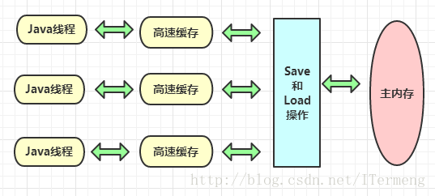

##Java
### 1.多线程
#### 1.1 进程状态
<br/>

> **1.NEW(新建尚未运行/启动)**
>
> 还没调用start，或者调用了start()方法，不一定立即改变线程状态，中间可能需要一些步骤才完成一个线程的启动。
>
> **2.RUNNABLE(处于可运行状态：正在运行或准备运行)**
> 
> start调用结束，线程由NEW变成RUNNABLE，存活着，并尝试占用CPU资源，yield操作时，线程还是RUNNABLE状态，只是它有一个细节的内部变化，做一个简单的让步。在Java层面是RUNNABLE的状态，并不代表一定处于运行中的状态，比如BIO中，线程正阻塞在网络等待的时候，看到的状态依然是RUNNABLE状态，而底层线程已经被阻塞住了。
>
> **3.BLOCKED(等待获取锁时进入的状态)** 
> 线程被挂起了，原因通常是因为它在等待一个锁，当某个**synchronized**正好有线程在使用时，一个线程尝试进入这个临界区，就会被阻塞，直到另一个线程走完临界区或发生了相应锁对象的wait操作后，它才有机会去争夺进入临界区的权利。当抢到锁之后，才会从BLOCKED状态恢复到RUNNABLE状态。这个状态它好像什么也不做一样。
>
> **4.WAITING(通过wait方法进入的等待)** 
>
>当wait，join，park方法调用时，进入waiting状态。前提是这个线程已经拥有锁了。
>
>>BLOCKED和WAITING状态的区别是：
>
>>A、blocked是虚拟机认为程序还不能进入某个区域，因为同时进去就会有问题，这是一块临界区。
>>B、发生wait等操作的先决条件是要进入临界区，也就是线程已经拿到锁了，自己可能进去做了一些事情，但此时通过判定业务上的参数，发现还有一些其他配合的资源没有准备充分，那么自己就等等再做其他事情。

>在WAITING状态下，如果发生了interrupt操作，则处于该状态的线程在内部会抛出一个InterruptedException，这个异常应当在run方法内捕获，使得run方法正常地执行完成，当然捕获异常后，是决定让线程继续运行，还是结束等要根据业务场景才处理。如果发生了notify动作，则会从等待池当中唤醒一个线程重新恢复到Runnable状态，如果是notifyall操作，则唤醒所有等待线程。 
>
> **5.TIMED_WAITING(通过sleep或wait timeout方法进入的限期等待的状态)**
> 
> 通过wait(t),sleep(t),join(t),parkNanos,parkUntil等方法进入此状态。当时间达到时触发线程回到工作状态Runnable。interrupt只对处于waiting或timed_waiting状态的线程起作用，对其他状态不起作用。 
>
> **6.TERMINATED(线程终止状态)**
> 
> 线程结束了，就处于这种状态，也就是run方法运行完了。这只是Java语言级别的一种状态，在操作系统内部可能已经注销了相应的线程，或者将它复用给其他需要使用线程的请求。


#### 1.2 开启线程的三种方式
     1.新建类继承 Thread 类实现线程

     2.通过实现接口 Runnable 实现创建线程

     3.使用 Callable、ExecutionException、ExecutorService、Future 等类，Executors 框架实现线程，此方法：相对前两种可抛异常，且有返回值。

>    **说明**：前两种主要是通过继承线程类或实现接口，来实现 run() 方法，线程对象调用 start() 方法启动线程
#### 1.3 run()和start()方法区别
   
    start() : 它的作用是启动一个新线程，新线程会执行相应的run()方法。start()不能被重复调用。

    run() : run()就和普通的成员方法一样，可以被重复调用。单独调用run()的话，会在当前线程中执行run()，而并不会启动新线程！
#### 1.4sleep/wait/notify
>    sleep()方法是Thread类中方法，而wait()方法是Object类中的方法。
    
>    sleep()方法导致了程序暂停执行指定的时间，让出cpu该其他线程，但是他的监控状态依然保持者，当指定的时间到了又会自动恢复运行状态，在调用sleep()方法的过程中，线程不会释放对象锁。
    
>    当调用wait()方法的时候，线程会放弃对象锁，进入等待此对象的等待锁定池，只有针对此对象调用notify()方法后本线程才进入对象锁定池准备 

#### 1.5Java线程池

#### 1.6synchronized与Lock的区别、synchronized用法
>主要相同点：Lock能完成synchronized所实现的所有功能
    
>主要不同点：Lock有比synchronized更精确的线程语义和更好的性能。Lock的锁定是通过代码实现的，而synchronized是在JVM层面上实现的，synchronized会自动释放锁，而Lock一定要求程序员手工释放，并且必须在finally从句中释放。Lock还有更强大的功能，例如，它的tryLock方法可以非阻塞方式去拿锁。Lock锁的范围有局限性，块范围，而synchronized可以锁住块、对象、类。

#### 1.7并发特性
>**1.原子性**
>
>     即一个操作或者多个操作 要么全部执行并且执行的过程不会被任何因素打断，要么就都不执行
>在Java中，对基本数据类型的变量的读取和赋值操作是原子性操作，即这些操作是不可被中断的，要么执行，要么不执行。
>上面一句话虽然看起来简单，但是理解起来并不是那么容易。看下面一个例子i：

>请分析以下哪些操作是原子性操作：
>
>     x = 10;         //语句1
>
>     y = x;         //语句2
>
>     x++;           //语句3
>
>     x = x + 1;     //语句4
>     
>咋一看，有些朋友可能会说上面的4个语句中的操作都是原子性操作。其实只有语句1是原子性操作，其他三个语句都不是原子性操作。

>语句1是直接将数值10赋值给x，也就是说线程执行这个语句的会直接将数值10写入到工作内存中。

>语句2实际上包含2个操作，它先要去读取x的值，再将x的值写入工作内存，虽然读取x的值以及 将x的值写入工作内存 这2个操作都是原子性操作，但是合起来就不是原子性操作了。

>同样的，x++和 x = x+1包括3个操作：读取x的值，进行加1操作，写入新的值。

>所以上面4个语句只有语句1的操作具备原子性。

>也就是说，只有简单的读取、赋值（而且必须是将数字赋值给某个变量，变量之间的相互赋值不是原子操作）才是原子操作。

>不过这里有一点需要注意：在32位平台下，对64位数据的读取和赋值是需要通过两个操作来完成的，不能保证其原子性。但是好像在最新的JDK中，JVM已经保证对64位数据的读取和赋值也是原子性操作了。

>从上面可以看出，Java内存模型只保证了基本读取和赋值是原子性操作，如果要实现更大范围操作的原子性，可以通过synchronized和Lock来实现。由于synchronized和Lock能够保证任一时刻只有一个线程执行该代码块，那么自然就不存在原子性问题了，从而保证了原子性。

>**2.可见性**
>
>     可见性是指当多个线程访问同一个变量时，一个线程修改了这个变量的值，其他线程能够立即看得到修改的值。于可见性，Java提供了volatile关键字来保证可见性。

>volatile保证可见性的原理是在每次 访问变量时都会进行一次刷新，因此每次访问都是主内存中最新的版本。
　　当一个共享变量被volatile修饰时，它会保证修改的值会立即被更新到主存，当有其他线程需要读取时，它会去内存中读取新值。

>而普通的共享变量不能保证可见性，因为普通共享变量被修改之后，什么时候被写入主存是不确定的，当其他线程去读取时，此时内存中可能还是原来的旧值，因此无法保证可见性。

>另外，通过synchronized和Lock也能够保证可见性，synchronized和Lock能保证同一时刻只有一个线程获取锁然后执行同步代码，并且在释放锁之前会将对变量的修改刷新到主存当中。因此可以保证可见性。


>**3.有序性**

>     即程序执行的顺序按照代码的先后顺序执行。

>指令重排序，一般来说，处理器为了提高程序运行效率，可能会对输入代码进行优化，
它不保证程序中各个语句的执行先后顺序同代码中的顺序一致，但是它会保证程序最终
执行结果和代码顺序执行的结果是一致的。

#### 1.8volatile的原理</br>

>**可见性实现**

>线程本身并不直接与主内存进行数据的交互，而是通过线程的工作内存来完成相应的操作。这也是导致线程间数据不可见的本质原因。因此要实现volatile变量的可见性，直接从这方面入手即可。对volatile变量的写操作与普通变量的主要区别有两点：

>(1)修改volatile变量时会强制将修改后的值刷新的主内存中。

>(2)修改volatile变量后会导致其他线程工作内存中对应的变量值失效。因此，再读取该变量值的时候就需要重新从读取主内存中的值。

>通过这两个操作，就可以解决volatile变量的可见性问题。

#### 1.9synchronize的原理</br>
#### 1.10lock原理</br>

>Lock与synchronized的区别

>1. Lock的加锁和解锁都是由java代码配合native方法（调用操作系统的相关方法）实现的，而synchronize的加锁和解锁的过程是由JVM管理的

>2. 当一个线程使用synchronize获取锁时，若锁被其他线程占用着，那么当前只能被阻塞，直到成功获取锁。而Lock则提供超时锁和可中断等更加灵活的方式，在未能获取锁的     条件下提供一种退出的机制。

>3. 一个锁内部可以有多个Condition实例，即有多路条件队列，而synchronize只有一路条件队列；同样Condition也提供灵活的阻塞方式，在未获得通知之前可以通过中断线程以    及设置等待时限等方式退出条件队列。

>4. synchronize对线程的同步仅提供独占模式，而Lock即可以提供独占模式，也可以提供共享模式

#### 1.11volatile用法

     1.防止重排序
     2.实现可见性
     3.保证原子性
#### 1.12进程与线程
#### 1.13死锁

>死锁，是指多个进程循环等待它方占有的资源而无限期地僵持下去的局面。很显然，如果没有外力的作用，那麽死锁涉及到的各个进程都将永远处于封锁状态。
    
>只要下面四个条件有一个不具备，系统就不会出现死锁。
>
>>**〈1〉互斥条件**
>> 
>> 即某个资源在一段时间内只能由一个进程占有，不能同时被两个或两个以上的进程占有。这种独占资源如CD-ROM驱动器，打印机等等，必须在占有该资源的进程主动释放它之后，其它进程才能占有该资源。这是由资源本身的属性所决定的。如独木桥就是一种独占资源，两方的人不能同时过桥。
> 
>> **〈2〉不可抢占条件**
>> 
>> 进程所获得的资源在未使用输入代完毕之前，资源申请者不能强行地从资源占有者手中夺取资源，而只能由该资源的占有者进程自行释放。如过独木桥的人不能强迫对方后退，也不能非法地将对方推下桥，必须是桥上的人自己过桥后空出桥面（即主动释放占有资源），对方的人才能过桥。
    
>> **〈3〉占有且申请条件**
>> 
>> 进程至少已经占有一个资源，但又申请新的资源；由于该资源已被另外进程占有，此时该进程阻塞；但是，它在等待新资源之时，仍继续占用已占有的资源。还以过独木桥为例，甲乙两人在桥上相遇。甲走过一段桥面（即占有了一些资源），还需要走其余的桥面（申请新的资源），但那部分桥面被乙占有（乙走过一段桥面）。甲过不去，前进不能，又不后退；乙也处于同样的状况。
> 
>>**〈4〉循环等待条件**
>>
>>存在一个进程等待序列{P1，P2，...，Pn}，其中P1等待P2所占有的某一资源，P2等待P3所占有的某一源，......，而Pn等待P1所占有的的某一资源，形成一个进程循环等待环。就像前面的过独木桥问题，甲等待乙占有的桥面，而乙又等待甲占有的桥面，从而彼此循环等待。
  上面我们提到的这四个条件在死锁时会同时发生。也就是说，只要有一个必要条件不满足，则死锁就可以排除。

#### 1.14ReentrantLock
#### 1.15并发集合了解哪些
#### 1.16CAS介绍

>Compare and Swap, **比较并交换**。
>
> java.util.concurrent包中借助CAS实现了区别于synchronouse同步锁的一种乐观锁。
CAS有3个操作数，内存值V，旧的预期值A，要修改的新值B。当且仅当预期值A和内存值V相同时，将内存值V修改为B，否则什么都不做。

>**缺点**

>***ABA 问题***

>由于 CAS 设计机制就是获取某两个时刻(初始预期值和当前内存值)变量值，并进行比较更新，所以说如果在获取初始预期值和当前内存值这段时间间隔内，变量值由 A 变为 B 再变为 A，那么对于 CAS 来说是不可感知的，但实际上变量已经发生了变化；解决办法是在每次获取时加版本号，并且每次更新对版本号 +1，这样当发生 ABA 问题时通过版本号可以得知变量被改动过

>JDK 1.5 以后的 AtomicStampedReference 类就提供了此种能力，其中的 compareAndSet 方法就是 首先检查当前引用是否等于预期引用，并且当前标志是否等于预期标志，如果全部相等，则以原子方式将该引用和该标志的值设置为给定的更新值。

>***循环时间长开销大***

>所谓循环时间长开销大问题就是当 CAS 判定变量被修改了以后则放弃本次修改，但往往为了保证数据正确性该计算会以循环的方式再次发起 CAS，如果多次 CAS 判定失败，则会产生大量的时间消耗和性能浪费；如果JVM能支持处理器提供的pause指令那么效率会有一定的提升，pause指令有两个作用，第一它可以延迟流水线执行指令（de-pipeline）,使CPU不会消耗过多的执行资源，延迟的时间取决于具体实现的版本，在一些处理器上延迟时间是零。第二它可以避免在退出循环的时候因内存顺序冲突（memory order violation）而引起CPU流水线被清空（CPU pipeline flush），从而提高CPU的执行效率。

>***只能保证一个共享变量的原子操作***

>CAS 只对单个共享变量有效，当操作涉及跨多个共享变量时 CAS 无效；从 JDK 1.5开始提供了 AtomicReference 类来保证引用对象之间的原子性，你可以把多个变量放在一个对象里来进行 CAS 操作


#### 1.17如何保证多线程读写文件的安全
#### 1.18如何保证线程安全
### 2JVM
#### 2.1运行时区域内存
<br/>

>####1 . 程序计数器

>**(1)含义作用**

> 程序计数器（Program Counter Register）是一块较小的内存空间，可以看作是**当前线程**所执行的字节码的行号指示器。在虚拟机概念模型中，字节码解释器工作时就是通过改变计数器的值来选取下一条需要执行的字节码指令，分支、循环、跳转、异常处理、线程恢复等基础功能都需要依赖计数器。

>**(2)计数器与多线程**

>由于JVM的多线程时通过线程轮流切换并分配处理器执行时间的方式来实现的，在任何一个确定的时刻，一个处理器（对于多核处理器来说是一个内核）都只会执行一条线程中的指令。所以，为了线程切换后能恢复到正确的执行位置，每条线程需要一个独立的程序计数器，各线程之间计数器互不影响、独立存储，相当于是一块“线程私有”的内存。

>**虚拟机规范记录（有关异常）**

>若线程正在执行的是一个Java方法，这个计数器记录的时正在执行的虚拟机字节码指令的地址；若执行的是Native方法，则计数器为空（Undefined）。注意：此内存区域是唯一一个在Java虚拟机规范中没有规定任何 OutOfMemoryError情况的区域。

>####2.Java虚拟机栈

>**(1)含义作用**

>同程序计数器相同，**Java虚拟机栈（Java Virtual Machine Stacks）也是线程私有的，它的生命周期与线程相同**。虚拟机栈描述的是Java方法执行的内存模型：每个方法在执行的同时都会创建一个栈帧用于存储局部变量表、操作数栈、动态链接、方法出口等信息。每一个方法从调用直至执行完成的过程，会对应一个栈帧在虚拟机栈中入栈到出栈的过程。

>**(2)Java内存区分误区**

>大多数人以为Java内存区分为堆内存（Heap）和栈内存（Stack），这是一种误区，Java内存区域的划分远比这种粗糙的分法更加复杂。这种划分方式广泛流传是由于大多数开发者关注与对象内存分配关系最密切的内存区域就是这两块，有关“堆”的知识后续载提，这里的“栈”指的就是虚拟机栈，或者说是虚拟机栈中的变量表部分。

>**(3)虚拟机栈中的局部变量表**

>局部变量表中存放了编译期可知的

>八大数据类型（boolean、byte、char、short、int、float、long、double）。

>对象引用（reference类型，它不等于对象本身，可能是一个指向对象起始地址的指针，也可能是指向一个代表对象的句柄或其他与此对象相关的位置）

>returnAddress类型（指向了一条字节码指令的地址）

>其中64位长度的long和double类型的数据会占用2个局部变量空间（Slot），其余数据类型只占用1个。局部变量表所需的内存控件在编译期间完成分配，当进入一个方法时，这个方法需要在帧中分配多大的局部变量空间是完全确定的，在方法运行期间不会改变局部变量表的大小。

>**(4)虚拟机规范记录（有关异常）**

>在Java虚拟机规范中，对这个区域规定了两种异常状况：

>若线程请求的栈深度大于虚拟机所允许的深度，将抛出StackOverflowError异常。
若虚拟机可以动态扩展（当前大部分Java虚拟机都可动态扩展，只不过Java虚拟机规范也允许固定长度的虚拟机栈），当扩展时无法申请到足够的内存，就会抛出OutOfMemoryError异常。

>**3.本地方法栈**

>(1)含义作用

>本地方法栈（Native Method Stack）与虚拟机栈所发挥的作用类似，它们之间的区别是：虚拟机栈为虚拟机执行Java方法（也就是字节码）服务，而本地方法栈则为虚拟机使用到的Native方法服务。

>(2)虚拟机规范记录（有关异常）

>在虚拟机规范中对本地方法栈中使用的语言、方式和数据结构并无强制规定，因此具体的虚拟机可实现它。甚至有的虚拟机（Sun HotSpot虚拟机）直接把本地方法栈和虚拟机栈合二为一。

>与虚拟机一样，本地方法栈会抛出StackOverflowError和OutOfMemoryError异常。

>**4.Java堆**

>(1)含义作用

>对于大多数应用而言，Java堆（Heap）是Java虚拟机所管理的内存中最大的一块，它是被所有线程共享的一块内存区域，在虚拟机启动时创建。此内存区域唯一的目的是存放对象实例，几乎所有的对象实例都在这里分配内存。Java虚拟机规范中描述道：所有的对象实例以及数组都要在堆上分配，但是随着JIT编译器的发展和逃逸分析技术逐渐成熟，栈上分配、标量替换优化技术将会导致一些微妙的变化发生，所有的对象都在堆上分配的定论也并不“绝对”了。

>(2)Java堆与垃圾回收器

>Java堆是垃圾回收器管理的主要区域，因此被称为“GC堆”（Garbage Collected Heap）。

>从内存回收角度看，由于目前收集器基本采用分代收集算法，所以Java堆可细分为：新生代和老年代。

>从内存分配角度来看，线程共享的Java堆中可能划分出多个线程私有的分配缓冲区（TLAB：Thread Local Allocation Buffer）。


>(3)虚拟机规范记录（有关异常）

>根据Java虚拟机规范的规定，Java堆可以处于物理上不连续的内存中，只要逻辑上是连续的即可，就像磁盘空间。在实现时，可以实现成固定大小或可扩展的，不过当前主流虚拟机是按照可扩展进行实现的（通过-Xmx和 -Xms控制）。

>若堆中没有内存完成实例分配，并且堆也无法扩展时，将会抛出OutOfMemoryError异常。

>**5.方法区**

>(1)含义作用

>方法区（Method Area）与Java堆一样，是各个线程共享的内存区域，它用于存储已被虚拟机加载的类信息、常量、静态变量、即时编译器编译后的代码等数据。虽然Java虚拟机规范把方法区描述为堆的一个逻辑部分，但是它有一个别名叫做 Non-Heap（非堆），目的是为了和Java堆区分开来。

>(2)虚拟机规范记录（有关异常）

>Java虚拟机规范对方法区的限制非常宽松，除了和Java堆一样不需要连续的内存和可以选择固定大小或可扩展外，还可以选择不实现垃圾收集。相对而言，垃圾收集行为在这个区域比较少见。此区域的内存回收目标主要是针对常量池的回收和对类型的卸载，一般来说，回收效果难以令人满意，尤其是类型的卸载，条件相对苛刻，但是这部分区域回收是有必要的。

>根据Java虚拟机规范的规定，当方法无法满足内存需求时，将会抛出OutOfMemoryError异常。

>**6.运行时常量池**

>(1)含义作用

>运行时常量池（Runtime Constant Pool）是方法区的一部分。Class文件中除了有类的版本、字段、方法、接口等描述信息外，还有一项信息是常量池（Constant Pool Table），用于存放编译期生成的各种字面量和符号引用，这部分内容将在类加载后进入方法区的运行时常量池存放。

>(2)运行时常量池和Class文件

>Java虚拟机对Class文件每一部分（自然包括常量池）的格式有严格规定，每一个字节用于存储那种数据都必须符合规范上的要求才会被虚拟机认可、装载和执行。但对于运行时常量池，Java虚拟机规范没有做任何有关细节的要求，不同的提供商实现的虚拟机可以按照自己的需求来实现此内存区域。不过一般而言，除了保存Class文件中的描述符号引用外，还会把翻译出的直接引用也存储在运行时常量池中。

>运行时常量池相对于Class文件常量池的另外一个重要特征是具备动态性，Java语言并不要求常量一定只有编译器才能产生，也就是并非置入Class文件中的常量池的内容才能进入方法区运行时常量池，运行期间也可能将新的常量放入池中，此特性被开发人员利用得比较多的便是String类的intern() 方法。

>(3)**虚拟机规范记录（有关异常）**

>运行时常量池是方法区的一部分，自然受到方法区的内存限制，当常量池无法再申请到内存时会抛出OutOfMemoryError异常。

>**7.直接内存**

>(1)含义作用

>直接内存（Direct Memory）并不是虚拟机运行时数据的一部分，也不是Java虚拟机规范中定义的内存区域。但这部分内存也被频繁运用，而却可能导致OutOfMemoryError异常出现。

>(2)有关异常

>本机直接内存的分配不会受到Java堆大小的限制，但是既然是内存，还是会受到本机总内存（包括RAM以及SWAP区或分页文件）大小以及处理器寻址空间的限制。服务器管理员在配置虚拟机参数时，会根据实际内存设置-Xmx等参数信息，但经常忽略直接内存，使得各个内存区域总和大于物理内存限制（包括物理的和操作系统的限制），从而导致动态扩展时出现OutOfMemoryError异常。


#### 2.2GC回收策略

>**2.2.1判断对象是否存活**

>***1.引用计数算法***

>给对象添加一个引用计数器，每当有一个地方引用它时，计数器值就加1，当引用失效时，计数器值就减1，任何时刻计数器都为0的对象就是不可能再被使用的。

>引用计数算法的实现简单，判定效率也很高，在大部分情况下它都是一个不错的选择，当Java语言并没有选择这种算法来进行垃圾回收，主要原因是它很难解决对象之间的相互循环引用问题

>***2.根搜索算法***

>Java和C#中都是采用根搜索算法来判定对象是否存活的。这种算法的基本思路是通过一系列名为“GC Roots”的对象作为起始点，从这些节点开始向下搜索，搜索所走过的路径称为引用链，当一个对象到GC Roots没有任何引用链相连时，就证明此对象是不可用的。在Java语言里，可作为GC 

>Roots的兑现包括下面几种：

>•	虚拟机栈（栈帧中的本地变量表）中引用的对象。

>•	方法区中的类静态属性引用的对象。

>•	方法区中的常量引用的对象。

>•	本地方法栈中JNI（Native方法）的引用对象。


>实际上，在根搜索算法中，要真正宣告一个对象死亡，至少要经历两次标记过程：如果对象在进行根搜索后发现没有与GC Roots相连接的引用链，那它会被第一次标记并且进行一次筛选，筛选的条件是此对象是否有必要执行finalize（）方法。当对象没有覆盖finalize（）方法，或finalize（）方法已经被虚拟机调用过，虚拟机将这两种情况都视为没有必要执行。如果该对象被判定为有必要执行finalize（）方法，那么这个对象将会被放置在一个名为F-Queue队列中，并在稍后由一条由虚拟机自动建立的、低优先级的Finalizer线程去执行finalize（）方法。finalize（）方法是对象逃脱死亡命运的最后一次机会（因为一个对象的finalize（）方法最多只会被系统自动调用一次），稍后GC将对F-Queue中的对象进行第二次小规模的标记，如果要在finalize（）方法中成功拯救自己，只要在finalize（）方法中让该对象重引用链上的任何一个对象建立关联即可。而如果对象这时还没有关联到任何链上的引用，那它就会被回收掉。

>**2.2.2引用**

>***⑴强引用（StrongReference）***

>强引用是使用最普遍的引用。如果一个对象具有强引用，那垃圾回收器绝不会回收它。当内存空间不足，Java虚拟机宁愿抛出OutOfMemoryError错误，使程序异常终止，也不会靠随意回收具有强引用的对象来解决内存不足的问题。  ps：强引用其实也就是我们平时A a = new A()这个意思。

>***⑵软引用（SoftReference）***

>如果一个对象只具有软引用，则内存空间足够，垃圾回收器就不会回收它；如果内存空间不足了，就会回收这些对象的内存。只要垃圾回收器没有回收它，该对象就可以被程序使用。软引用可用来实现内存敏感的高速缓存（下文给出示例）。

>软引用可以和一个引用队列（ReferenceQueue）联合使用，如果软引用所引用的对象被垃圾回收器回收，Java虚拟机就会把这个软引用加入到与之关联的引用队列中。

>***⑶弱引用（WeakReference）***

>弱引用与软引用的区别在于：只具有弱引用的对象拥有更短暂的生命周期。在垃圾回收器线程扫描它所管辖的内存区域的过程中，一旦发现了只具有弱引用的对象，不管当前内存空间足够与否，都会回收它的内存。不过，由于垃圾回收器是一个优先级很低的线程，因此不一定会很快发现那些只具有弱引用的对象。

>弱引用可以和一个引用队列（ReferenceQueue）联合使用，如果弱引用所引用的对象被垃圾回收，Java虚拟机就会把这个弱引用加入到与之关联的引用队列中。

>***⑷虚引用（PhantomReference）***

>“虚引用”顾名思义，就是形同虚设，与其他几种引用都不同，虚引用并不会决定对象的生命周期。如果一个对象仅持有虚引用，那么它就和没有任何引用一样，在任何时候都可能被垃圾回收器回收。

>虚引用主要用来跟踪对象被垃圾回收器回收的活动。虚引用与软引用和弱引用的一个区别在于：虚引用必须和引用队列 （ReferenceQueue）联合使用。当垃圾回收器准备回收一个对象时，如果发现它还有虚引用，就会在回收对象的内存之前，把这个虚引用加入到与之关联的引用队列中。

>程序可以通过判断引用队列中是否已经加入了虚引用，来了解被引用的对象是否将要被垃圾回收。如果程序发现某个虚引用已经被加入到引用队列，那么就可以在所引用的对象的内存被回收之前采取必要的行动。

	1.显式的把（强引用）对象置为null，会大大加大 垃圾回收执行频率。几乎只要我们给出建议，jvm就会回收。 
	2.对于软引用，如果不显式的置为null的话，和强引用差不多，垃圾回收不会执行。只会等到内存不足的时候才会执行。 
	3.对于弱引用，就算你不显式的把他置为null，垃圾回收也会立即执行。 
	4.虚引用，相当于null，不解释。 


>**2.2.3垃圾收集算法**

>***1.标记清除算法***

>标记—清除算法是最基础的收集算法，它分为“标记”和“清除”两个阶段：首先标记出所需回收的对象，在标记完成后统一回收掉所有被标记的对象，它的标记过程其实就是前面的根搜索算法中判定垃圾对象的标记过程。

>***缺点：***

>(1)标记和清除效率不高

>(2)标记清除后会产生大量不连续的内存碎片，空间碎片太多可能会导致，当程序在以后的运行过程中需要分配较大对象时无法找到足够的连续内存而不得不触发另一次垃圾收集动作。


>***2.复制算法***

>将可用内存按照容量划分为大小相等的两块，每次只使用其中一块。当这一块内存用完后，将活着的对象复制到另一块上面，然后把已使用过的内存空间一次清理掉。

>现在商业虚拟机使用采用这种方法回收新生代，将内存分为**一块较大的Eden空间和两个较小的Survivor空间**，每次使用Eden和其中一块Survivor。当回收时，将Eden和Survivor中还存活的对象一次性拷贝到另外一块Survivor空间上，最后清理掉Eden和刚才使用过的Survivor空间

>***优点与缺陷***

>优点：这样使得每次都是对整个半区进行内存回收，内存分配时也就不用考虑内存碎片等复杂情况，只要移动堆顶指针，按顺序分配内存即可，实现简单，运行高效。

>缺陷：只是这种算法的代价是将内存缩小为原来的一半，代价过高。

>***3.标记整理算法***

>复制算法比较适合于新生代，在老年代中，对象存活率比较高，如果执行较多的复制操作，效率将会变低，所以老年代一般会选用其他算法，如标记—整理算法。该算法标记的过程与标记—清除算法中的标记过程一样，但对标记后出的垃圾对象的处理情况有所不同，它不是直接对可回收对象进行清理，而是让所有的对象都向一端移动，然后直接清理掉端边界以外的内存。

>***4.分代收集算法***

>当前商业虚拟机的垃圾收集都采用分代收集算法，此算法相较于前几种没有什么新的特征，主要思想为：根据对象存活周期的不同将内存划分为几块，一般是把Java堆分为新生代和老年代，这样就可以根据各个年代的特点采用最适合的收集算法。

>***算法建议***

    适于“新生代”的算法建议 

    在新生代中，每次垃圾收集时都发现有大批对象死去，只有少量存活，那就选用复制算法，只需要付出少量存活对象的复制成本就可以完成收集。

    适于“老年代”的算法建议 

    在老年代中，因为对象存活率高、没有额外空间对它进行分配担保，就必须使用“标记-清理”或“标记-整理”算法来进行回收。

>**2.2.4内存分配和回收策略**

>***Minor GC和Major GC区别***

>Minor GC（新生代GC）指发生在新生代的垃圾收集动作，因为Java对象大多都具备朝生夕灭的特性，所以Minor GC非常频繁，一般回收速度也比较快。

>Major GC/Full GC（老年代GC）指发生在老年代的GC,出现了Major GC,经常会伴随至少一次Minor GC（但非绝对）。Major GC速度一般比Minor GC慢10倍以上。

>**分配策略**

>1.对象优先在 Eden 分配

>2.大对象直接进入老年代

>>可以通过-XX:PretenureSizeThreshold设置超过多少大小的对象

>3.长期存活的对象将进入老年代

>>虚拟机给每个对象定义了一个对象年龄（Age）计数器。如果对象在Eden出生并经过第一次 Minor GC后仍然存活，并且能被Survivor 容纳的话，将被移动到 Survivor空间中，并且对象年龄设为1。对象在Survivor 区 每“熬过”一次Minor GC，年龄就增加1岁，当它的年龄增加到一定程度（默认为15岁），就会晋升到老年代中。

>>可通过-XX:MaxTenuringThreshold来设置对象晋升老年代的年龄阀值。

>4.动态对象年龄判断

>>为了能够更好地适应不同程序的内存状况，虚拟机并不是永远地要求对象年龄必须达到MaxTenuringThreshold规定值才能晋升老年代，如果在 Survivor 空间中相同年龄所有对象大小的总和大于Survivor 空间的一半，年龄大于或等于该年龄的对象就可以直接进入老年代，无须等到参数的规定值。

>5.空间分配担保

>>在发生 Minor GC之前，虚拟机会先检查老年代最大可用的连续空间是否大于新生代所有对象总空间。

>>5.1如果以上条件成立，那么 Minor GC可确保时安全的。

>>5.2若不成立，则虚拟机会查看HandlePromotionFailure参数设置值是否允许担保失败。如果允许，那么会继续检查老年代最大可用的连续空间是否大于历次晋升到老年代对象的平均大小。 
如果大于，将尝试着进行一次Minor GC，尽管这次Minor GC是有风险的；
如果小于或者HandlePromotionFailure参数设置不允许“冒险”，此时改为进行一次 Full GC。


#### 2.3Java中对象的生命周期
#### 2.4JVM 内存区域 开线程影响哪块内存（内存分配）
#### 2.5JVM内存模型

>定义程序中各个变量的访问规则，即在虚拟机中将变量存储到内存和从内存中读取变量这样的底层细节.

>Java内存模型规定了：***所有的变量都存储在主内存中。***

>每条线程还有自己的工作内存，线程的工作内存中保存了被该线程使用到的变量的主内存副本拷贝，线程对变量的所有操作（读取，赋值）都必须在工作内存中进行，而不能直接读写内存中的变量。不同的线程之间也无法直接访问对方工作内存中的变量。

	在内存模型中 
	1.使用volatile实现可见性，即在多线程时候，当一个线程修改参数，会通知其他线程将参数置为不可用，需要从内存中读取。
	2.要通过加锁（使用 synchronize 或 java.util.concurrent中的原子类）来保证原子性。
	3.使用volatile变量的第二个语义是禁止指令重排序优化：**普通变量仅仅会保证在该方法的执行过程中所有依赖赋值结果的地方都能获取到正确的结果，而不能保证变量赋值操作的顺序与程序代码中的执行顺序一致。**



#### 2.6类加载机制

>类从被加载到虚拟机内存中开始，到卸载出内存为止，它的整个生命周期包括：加载、验证、准备、解析、初始化、使用和卸载七个阶段。它们开始的顺序如下图所示：


>其中类加载的过程包括了加载、验证、准备、解析、初始化五个阶段。在这五个阶段中，加载、验证、准备和初始化这四个阶段发生的顺序是确定的，而解析阶段则不一定，它在某些情况下可以在初始化阶段之后开始，这是为了支持Java语言的运行时绑定（也成为动态绑定或晚期绑定）。另外注意这里的几个阶段是按顺序开始，而不是按顺序进行或完成，因为这些阶段通常都是互相交叉地混合进行的，通常在一个阶段执行的过程中调用或激活另一个阶段。

#### 2.7类加载器与双亲委派模型

>**类加载器**

>(1)***Bootstrap ClassLoader*** : 将存放于<JAVA_HOME>\lib目录中的，或者被-Xbootclasspath参数所指定的路径中的，并且是虚拟机识别的（仅按照文件名识别，如 rt.jar 名字不符合的类库即使放在lib目录中也不会被加载）类库加载到虚拟机内存中。启动类加载器无法被Java程序直接引用

>(2)***Extension ClassLoader*** : 将<JAVA_HOME>\lib\ext目录下的，或者被java.ext.dirs系统变量所指定的路径中的所有类库加载。开发者可以直接使用扩展类加载器。

>(3)***Application ClassLoader*** : 负责加载用户类路径(ClassPath)上所指定的类库,开发者可直接使用。

>**双亲委派模型**


>工作过程：如果一个类加载器接收到了类加载的请求，它首先把这个请求委托给他的父类加载器去完成，每个层次的类加载器都是如此，因此所有的加载请求都应该传送到顶层的启动类加载器中，只有当父加载器反馈自己无法完成这个加载请求（它在搜索范围中没有找到所需的类）时，子加载器才会尝试自己去加载。

>好处：java类随着它的类加载器一起具备了一种带有优先级的层次关系。例如类java.lang.Object，它存放在rt.jar中，无论哪个类加载器要加载这个类，最终都会委派给启动类加载器进行加载，因此Object类在程序的各种类加载器环境中都是同一个类。相反，如果用户自己写了一个名为java.lang.Object的类，并放在程序的Classpath中，那系统中将会出现多个不同的Object类，java类型体系中最基础的行为也无法保证，应用程序也会变得一片混乱。

>>***双亲委派模型的系统实现***

	1.先检查是否已经被加载过

	2.若没有被加载过，则接着判断父加载器是否为空。
		2.1若不为空，则调用父类加载器的loadClass()方法。
		2.2若父加载器为空，则默认使用启动类加载器作为父加载器。
	
	3.如果父加载失败，则抛出ClassNotFoundException异常后，再调用自己的findClass()方法进行加载

###集合类
####HashMap实现原理

>通过数组+链表实现，通过**链地址法解决hash冲突**


####hashmap如何put数据（从hashmap源码角度讲解）？

	1.当key不为空时，获取对应的hash值和对应数组的位置
	2.判断key是否已经存在，如果存在 更新value值	不存在 新建节点放到map中

	``` public V put(K key, V value) {
        if (key == null)
            return putForNullKey(value); //null总是放在数组的第一个链表中
        int hash = hash(key.hashCode());
        int i = indexFor(hash, table.length);
        //遍历链表
        for (Entry<K,V> e = table[i]; e != null; e = e.next) {
            Object k;
            //如果key在链表中已存在，则替换为新value
            if (e.hash == hash && ((k = e.key) == key || key.equals(k))) {
                V oldValue = e.value;
                e.value = value;
                e.recordAccess(this);
                return oldValue;
            }
        }
        modCount++;
        addEntry(hash, key, value, i);
        return null;
    }
 
	void addEntry(int hash, K key, V value, int bucketIndex) {
	    Entry<K,V> e = table[bucketIndex];
	    table[bucketIndex] = new Entry<K,V>(hash, key, value, e); //参数e, 是Entry.next
	    //如果size超过threshold，则扩充table大小。再散列
	    if (size++ >= threshold)
	            resize(2 * table.length);
	}```

	

	```
	public V get(Object key) {
        if (key == null)
            return getForNullKey();
        int hash = hash(key.hashCode());
        //先定位到数组元素，再遍历该元素处的链表
        for (Entry<K,V> e = table[indexFor(hash, table.length)];
             e != null;
             e = e.next) {
            Object k;
            if (e.hash == hash && ((k = e.key) == key || key.equals(k)))
                return e.value;
        }
        return null;
	}```

####ConcurrentHashMap 的实现原理
####集合 Set实现 Hash 怎么防止碰撞
####TreeMap
####HashSet与HashMap怎么判断集合元素重复
###抽象类和接口的区别
###进程调度
###Java注解
###String buffer 与String builder 的区别
###String 为什么要设计成不可变的

###Object类的equal 和hashcode 方法重写，为什么？</br>

>1、 为什么要重载equal方法？

>答案：因为Object的equal方法默认是两个对象的引用的比较，意思就是指向同一内存,地址则相等，否则不相等；如果你现在需要利用对象里面的值来判断是否相等，则重载equal方法。

>2、 为什么重载hashCode方法？

>答案：一般的地方不需要重载hashCode，只有当类需要放在HashTable、HashMap、HashSet等等hash结构的集合时才会重载hashCode，那么为什么要重载hashCode呢？就HashMap来说，好比HashMap就是一个大内存块，里面有很多小内存块，小内存块里面是一系列的对象，可以利用hashCode来查找小内存块hashCode%size(小内存块数量)，所以当equal相等时，hashCode必须相等，而且如果是object对象，必须重载hashCode和equal方法。

>3、 为什么equals()相等，hashCode就一定要相等，而hashCode相等，却不要求equals相等?

>答案：1、因为是按照hashCode来访问小内存块，所以hashCode必须相等。

>2、HashMap获取一个对象是比较key的hashCode相等和equal为true。之所以hashCode相等，却可以equal不等，就比如ObjectA和ObjectB他们都有属性name，那么hashCode都以name计算，所以hashCode一样，但是两个对象属于不同类型，所以equal为false。

>4、 为什么需要hashCode?

>1、 通过hashCode可以很快的查到小内存块。
>
>2、通过hashCode比较比equal方法快，当get时先比较hashCode，如果hashCode不同，直接返回false。


##Android
###LruCache原理

>Lru的全称是Least Recently Used ，近期最少使用的！实现原理：把近期最少使用的数据从缓存中移除，保留使用最频繁的数据

>Lru算法的实现就是通过LinkedHashMap来实现的。LinkedHashMap继承于HashMap，它使用了一个双向链表来存储Map中的Entry顺序关系，这种顺序有两种，一种是LRU顺序，一种是插入顺序，这可以由其构造函数public LinkedHashMap(int initialCapacity,float loadFactor, boolean accessOrder)指定。所以，对于get、put、remove等操作，LinkedHashMap除了要做HashMap做的事情，还做些调整Entry顺序链表的工作。LruCache中将LinkedHashMap的顺序设置为LRU顺序来实现LRU缓存，每次调用get(也就是从内存缓存中取图片)，则将该对象移到链表的尾端。调用put插入新的对象也是存储在链表尾端，这样当内存缓存达到设定的最大值时，将链表头部的对象（近期最少用到的）移除。

###Glide原理

####glide 使用什么缓存

>Glide的缓存机制分为两级，第一级是***内存缓存***，然后第二级是***硬盘缓存***。缓存的过程首先是在内存中缓存，然后将加载的图片资源缓存到硬盘，这样就可以在随后的再次加载中使用缓存了，Glide使用缓存时候首先要检查内存这一层级是否缓存了相应的缓存，如果有，则直接使用，如果没有，则深入到硬盘缓存中检查是否有，如果有，则加载之，如果到这一步骤还没有，那么就只能作为一个全新的资源加载了。

>**内存缓存**

>***读取缓存***

>内存缓存读取在Engine的load方法中，使用到Lru算法，首先从缓存中读取，如果读取到，则从缓存删除，放到activeResources（就是一个弱引用的HashMap）中，如果在缓存中读取不到，则在activeResources中读取，在读取不到就到异步线程（EngineRunnable）中在硬盘读取或者下载。

>***写入缓存***

>当图片记载完成后会在EngineJob当中通过Handler发送一条消息将执行逻辑切回到主线程当中，从而执行handleResultOnMainThread()方法。然后再回调到Engine的onEngineJobComplete()中，回调过来的EngineResource被put到了activeResources当中，也就是在这里写入的缓存。即完成了在***弱引用的缓存***

>在handleResultOnMainThread()方法，有调用EngineResource的acquire()方法和它的release()方法。其实，EngineResource是用一个acquired变量用来记录图片被引用的次数，调用acquire()方法会让变量加1，调用release()方法会让变量减1。当acquired变量大于0的时候，说明图片正在使用中，也就应该放到activeResources弱引用缓存当中。而经过release()之后，如果acquired变量等于0了，说明图片已经不再被使用了，那么此时会在第24行调用Engine的onResourceReleased()方法来释放资源。***首先会将缓存图片从activeResources中移除，然后再将它put到LruResourceCache当中。这样也就实现了正在使用中的图片使用弱引用来进行缓存，不在使用中的图片使用LruCache来进行缓存的功能。***

>**硬盘缓存**

####Glide 内存缓存如何控制大小
###统计启动时长、标准


###ThreadLocal原理

>在ThreadLocal类中有一个静态内部类ThreadLocalMap(其类似于Map)，用键值对的形式存储每一个线程的变量副本，ThreadLocalMap中元素的key为当前ThreadLocal对象，而value对应线程的变量副本，每个线程可能存在多个ThreadLocal。

	```
	public T get() {
	    Thread t = Thread.currentThread();//当前线程
	    ThreadLocalMap map = getMap(t);//获取当前线程对应的ThreadLocalMap
	    if (map != null) {
	        ThreadLocalMap.Entry e = map.getEntry(this);//获取对应ThreadLocal的变量值
	        if (e != null) {
	            @SuppressWarnings("unchecked")
	            T result = (T)e.value;
	            return result;
	        }
	    }
	    return setInitialValue();//若当前线程还未创建ThreadLocalMap，则返回调用此方法并在其中调用createMap方法进行创建并返回初始值。
	}
	//设置变量的值
	public void set(T value) {
	   Thread t = Thread.currentThread();
	   ThreadLocalMap map = getMap(t);
	   if (map != null)
	       map.set(this, value);
	   else
	       createMap(t, value);
	}
	private T setInitialValue() {
	   T value = initialValue();
	   Thread t = Thread.currentThread();
	   ThreadLocalMap map = getMap(t);
	   if (map != null)
	       map.set(this, value);
	   else
	       createMap(t, value);
	   return value;
	}
	/**
	为当前线程创建一个ThreadLocalMap的threadlocals,并将第一个值存入到当前map中
	@param t the current thread
	@param firstValue value for the initial entry of the map
	*/
	void createMap(Thread t, T firstValue) {
	    t.threadLocals = new ThreadLocalMap(this, firstValue);
	}
	//删除当前线程中ThreadLocalMap对应的ThreadLocal
	public void remove() {
	       ThreadLocalMap m = getMap(Thread.currentThread());
	       if (m != null)
	           m.remove(this);
	}```

>***内存泄漏***

>由于ThreadLocalMap的生命周期跟Thread一样长，如果都没有手动删除对应key，都会导致内存泄漏，但是使用弱引用可以多一层保障：弱引用ThreadLocal不会内存泄漏，对应的value在下一次ThreadLocalMap调用set,get,remove的时候会被清除。所以在使用ThreadLocal当key使用完成的时候需要remove掉。

###热修复、插件化

###性能优化
####保证应用不卡顿
####Android相关优化（如内存优化、网络优化、布局优化、电量优化、业务优化）

###SP是进程同步的吗?有什么方法做到同步

>SP中2.3以下默认实现同步，但是在2.3以后需要设置参数***MODE_MULTI_PROCESS***，这样不同进程加载可以实现同步


###BroadcastReceiver，LocalBroadcastReceiver 区别

>1.其他App可能发出和本App需要类型相同的广播，导致App不断接收广播并处理

>2.其他App接收到本App发送的广播

>***解决方案：***
	
	1.将全局广播设置成局部广播
	（1）注册广播时将exported设置为false
	（2）增加权限设置
	（3）使用intent.setPackage去指定接收者的包名
	2.使用LocalBroadcastManager类

###Handler 机制
>***3.6.1相关概念***


>Message
>
>定义：消息，理解为线程间通讯的数据单元（Handler接受和处理的消息对象。）
>
>Message Queue
>
>消息队列，用于存放Handler发送的消息，先进先出
>
>Handler

>是Message的主要处理者，负责将Message添加到队列或者处理Looper分派过来的Message

>Looper 

>扮演Message Queue和Handler之间桥梁的角色，循环取出Message Queue的Message,将取出的Message交给对应的Handler


>***3.6.2方法***


>Handler
>
>提供sendMessage方法，将消息放置到队列中 

>提供handleMessage方法，定义个各种消息的处理方式；

>Looper

>Looper.prepare()：实例化Looper对象；为当前线程生成一个消息队列；

>Looper.loop() ：循环从消息队列中获取消息，交给Handler处理；此时线程处于无限循环中，不停的从MessageQueue中获取Message 消息 ；如果没有消息就阻塞
> 
>MessageQueue
>
>提供enqueueMessage 方法，将消息根据时间放置到队列中；
>
>提供next方法，从队列中获取消息，没有消息的时候阻塞；

	Handler工作流程解释
	异步通信传递机制步骤主要包括异步通信的准备、消息发送、消息循环和消息处理
	1.	异步通信的准备
	包括Looper对象的创建&实例化、MessageQueue队列的创建和Handler的实例化
	2.	消息发送
	Handler将消息发送到消息队列中
	3.	消息循环
	Looper执行Looper.loop()进入消息循环，在这个循环过程中，不断从该Message Queue取出消息，并将取出的消息派发给创建该消息的Handler
	4.	消息处理
	调用该Handler的dispatchMessage(msg)方法，即回调handleMessage(msg)处理消息

>***3.6.3Looper***
>
>Looper主要是prepare()和loop()两个方法.

>在prepare()判断已经创建MessageQueue，未创建则调用Looper构造方法创建一个MessageQueue。

>在loop()中，进行无限循环去取消息，若无消息则阻塞，若取到消息，则msg.target.dispatchMessage(msg);把消息交给msg的target的dispatchMessage方法去处理。

>***3.6.4Handler***
>
>Handler主要完成：

>1.在主线程中发消息给MessageQueue

>使用Handler之前，会初始化一个Handler实例，在创建实例时，会通过Loop.myLooper()获取当前线程的Looper对象，不存在则抛出异常。
Handler想MessageQueue发送消息可以发送post和send两种，相比send方法，post最大不同在于更新操作可以直接在重写run方法定义，在发送消息最终都会调用queue.enqueueMessage()将消息放入对流

>2.处理Looper派发来的消息：dispatchMessage();

>调用send是的handlerMessage回调方法或者post时的msg回调


>***3.6.5MessageQueue***
>
>MessageQueue包含enqueueMessage入队操作和next()出队操作

>***3.6.6其他***
>
>一个Thread（线程）只能有一个Looper，可以有多个Handler
>
>一个Looper可以绑定多个Handler；
>
>一个Handler只能绑定一个Looper；

###Android事件分发机制

>**事件分发需要View的三个重要方法来共同完成：**

>***public boolean dispatchTouchEvent(MotionEvent event)***

>如果一个MotionEvent传递给了View，那么dispatchTouchEvent方法一定会被调用！

>返回值：表示是否消费了当前事件。可能是View本身的onTouchEvent方法消费，也可能是子View的dispatchTouchEvent方法中消费。返回true表示事件被消费，本次的事件终止。返回false表示View以及子View均没有消费事件，将调用父View的onTouchEvent方法

>***public boolean onInterceptTouchEvent(MotionEvent ev)***

>事件拦截，当一个ViewGroup在接到MotionEvent事件序列时候，首先会调用此方法判断是否需要拦截。特别注意，这***是ViewGroup特有的方法***，View并没有拦截方法

>返回值：是否拦截事件传递，返回true表示拦截了事件，那么事件将不再向下分发而是调用View本身的onTouchEvent方法。返回false表示不做拦截，事件将向下分发到子View的dispatchTouchEvent方法。

>***public boolean onTouchEvent(MotionEvent ev)***

>真正对MotionEvent进行处理或者说消费的方法。在dispatchTouchEvent进行调用。

>返回值：返回true表示事件被消费，本次的事件终止。返回false表示事件没有被消费，将调用父View的onTouchEvent方法


###App启动流程，从点击桌面开始


###Android 的大体架构图


> Android的系统架构采用了分层架构的思想，如上图所示。从上层到底层共包括四层，分别是应用程序程序层、应用框架层、系统库和Android运行时和Linux内核。

>一 应用程序层


>该层提供一些核心应用程序包，例如电子邮件、短信、日历、地图、浏览器和联系人管理等。同时，开发者可以利用Java语言设计和编写属于自己的应用程序，而这些程序与那些核心应用程序彼此平等、友好共处。
 
>二 应用程序框架层
 
>该层是Android应用开发的基础，开发人员大部分情况是在和她打交道。应用程序框架层包括活动管理器、窗口管理器、内容提供者、视图系统、包管理器、电话管理器、资源管理器、位置管理器、通知管理器和XMPP服务十个部分。在Android平台上，开发人员可以完全访问核心应用程序所使用的API框架。并且，任何一个应用程序都可以发布自身的功能模块，而其他应用程序则可以使用这些已发布的功能模块。基于这样的重用机制，用户就可以方便地替换平台本身的各种应用程序组件。
 
>三 系统库和Android运行时

>系统库包括九个子系统，分别是图层管理、媒体库、SQLite、OpenGLEState、FreeType、WebKit、SGL、SSL和libc。Android运行时包括核心库和Dalvik虚拟机，前者既兼容了大多数Java语言所需要调用的功能函数，又包括了Android的核心库，比如android.os、android.net、android.media等等。后者是一种基于寄存器的java虚拟机，Dalvik虚拟机主要是完成对生命周期的管理、堆栈的管理、线程的管理、安全和异常的管理以及垃圾回收等重要功能。

>四 Linux内核

>Android核心系统服务依赖于Linux2.6内核，如安全性、内存管理、进程管理、网络协议栈和驱动模型。Linux内核也是作为硬件与软件栈的抽象层。驱动：显示驱动、摄像头驱动、键盘驱动、WiFi驱动、Audio驱动、flash内存驱动、Binder（IPC）驱动、电源管理等。

###点击 Android Studio 的 build 按钮后发生了什么


>**1.AAPT(Android Asset Packaging Tool)工具会打包应用中的资源文件**
>
>如AndroidManifest.xml、layout布局中的xml等，并将xml文件编译为二进制形式，当然assets文件夹中的文件不会被编译，图片及raw文件夹中的资源也会保持原来的形态，需要注意的是raw文件夹中的资源也会生成资源id。AAPT编译完成之后会生成R.java文件。
>**2.AIDL工具会将所有的aidl接口转化为java接口。**
>
>**3.所有的java代码，包括R.java与aidl文件都会被Java编译器编译成.class文件。**
>
>**4.Dex工具会将上述产生的.class文件及第三库及其他.class文件编译成.dex文件（dex文件是Dalvik虚拟机可以执行的格式），dex文件最终会被打包进APK文件。**
>
>**5.ApkBuilder工具会将编译过的资源及未编译过的资源（如图片等）以及.dex文件打包成APK文件。**
>
>**6.通过Jarsigner工具，对上面的apk进行debug或release签名**
>
>生成APK文件后，需要对其签名才可安装到设备，平时测试时会使用debug keystore，当正式发布应用时必须使用release版的keystore对应用进行签名。
>
>**7. 通过zipalign工具，将签名后的apk进行对齐处理。**
>
>调用buildtoolszipalign，对签名后的apk文件进行对齐处理，使apk中所有资源文件距离文件起始偏移为4字节的整数倍，从而在通过内存映射访问apk文件时会更快。同时也减少了在设备上运行时的内存消耗。这样我们的最终apk就生成完毕了。

###一个应用程序安装到手机上时发生了什么
###对 Dalvik、ART 虚拟机有基本的了解
###Android 上的 Inter-Process-Communication 跨进程通信时如何工作的


###App 是如何沙箱化，为什么要这么做；

>Android“沙箱”的本质是为了实现不同应用程序和进程之间的互相隔离，即在默认情况 下，应用程序没有权限访问系统资源或其它应用程序的资源。每个APP和系统进程都被分配唯一并且固定的User Id，这个uid与内核层进程的uid对应。每个APP在各自独立的Dalvik虚拟机中运行，拥有独立的地址空间和资源。运行于Dalvik虚拟机中的 进程必须依托内核层Linux进程而存在，因此Android使用Dalvik虚拟机和Linux的文件访问控制来实现沙箱机制，任何应用程序如果想要访 问系统资源或者其它应用程序的资源必须在自己的manifest文件中进行声明权限或者共享uid。
 
>安装在设备中的每一个apk文件，Android给每个APK进程分配一个单独的用户空间,其manifest中的userid就是对应一个Linux 用户都会被分配到一个属于自己的统一的Linux用户ID，并且为它创建一个沙箱，以防止影响其他应用程序（或者其他应用程序影响它）。用户ID 在应用程序安装到设备中时被分配，并且在这个设备中保持它的永久性。
 
>通过Shared User id,拥有同一个User id的多个APK可以配置成运行在同一个进程中.所以默认就是可以互相访问任意数据. 也可以配置成运行成不同的进程, 同时可以访问其他APK的数据目录下的数据库和文件.就像访问本程序的数据一样.

###动态权限适配方案，权限组的概念

>在***M版本(23)***之前，应用App需要用到什么权限只需要在AndroidManifest.xml配置文件中增加相对应权限的配置，然后在App中就可以随便无限制的使用这些权限来访问用户的设备了。由于这种权限的漏洞，导致了大量的用户信息的泄露。所以在M版本上，Android官方团队重新修改了这个权限的申请方式。在新的权限模式之下，用户将能够根据自己的实际需要在运行时中对各项权限进行审核，且随时关闭其中的部分权限。

>在Android6.0之前，所有的权限都是安装时权限，即安装时就可获取，在6.0开始讲权限做了区分，运行时权限，同时将权限分组，同一权限组的权限，只要获取一个权限，同一权限组的其他权限也都会获得。


###RecycleView的使用，原理,recycleview listview 的区别,性能

>***使用***

>需要提供一个RecyclerView.Apdater的实现用于处理数据集与ItemView的绑定关系，和一个RecyclerView.LayoutManager的实现用于 测量并布局 ItemView


###listview图片加载错乱的原理和解决方案

>**原理**

	1.listview中item加载的时候采用复用机制，当item移出屏幕时会再复用

	2.图片的异步加载

>**解决方案**

	为imageView设置一个唯一的tag（比如url），当图片加载完成的时候比较imageview的tag是否对应这张图片，等于则加载


###RxJava

###网络请求缓存处理，okhttp如何处理网络缓存的

>1.使用文件进行缓存

>当请求到数据后，将数据缓存到文件中，下次请求的时候读取文件的上次修改时间，当大于一定的时间则重新请求，小于时间和读取缓存中的数据

>2.okhttp网络缓存

###图片加载库相关，bitmap如何处理大图，如一张30M的大图，如何预防OOM
###进程保活

###广播（动态注册和静态注册区别，有序广播和标准广播）
###广播的使用场景
	1.用于监听系统广播，例如：wifi,蓝牙之类的
	2.用于多进程之间
###service生命周期
####Android系统为什么会设计ContentProvider，进程共享和线程安全问题
####Android线程有没有上限，然后提到线程池的上限
###数据库数据迁移问题
###进程间通信的方式

###activity栈
>***（1）Standard模式***

>又称为标准模式，也是系统的默认模式（可以不指定），在这样模式下，每启动一个Activity都会重新创建一个Activity的新实例，并且将其加入任务栈中，而且完全不会去考虑这个实例是否已存在。

>例如：
>若我有一个Activity名为A1, 上面有一个按钮可跳转到A1。那么如果我点击按钮，便会新启一个Activity A1叠在刚才的A1之上，再点击，又会再新启一个在它之上……点back键会依照栈顺序依次退出。

>***（2）SingleTop***

>可以有多个实例，但是不允许多个相同Activity叠加。即，如果Activity在栈顶的时候，启动相同的Activity，不会创建新的实例，而会调用其onNewIntent方法。

>例如：
>若我有两个Activity名为B1,B2,两个Activity内容功能完全相同，都有两个按钮可以跳到B1或者B2，唯一不同的是B1为standard，B2为singleTop。
>
>若我意图打开的顺序为B1->B2->B2，则实际打开的顺序为B1->B2（后一次意图打开B2，实际只调用了前一个的onNewIntent方法）

>若我意图打开的顺序为B1->B2->B1->B2，则实际打开的顺序与意图的一致，为B1->B2->B1->B2。

>***（3）SingleTask***

>只有一个实例。在同一个应用程序中启动他的时候，若Activity不存在，则会在当前task创建一个新的实例，若存在，则会把task中在其之上的其它Activity destory掉并调用它的onNewIntent方法。

>如果是在别的应用程序中启动它，则会新建一个task，并在该task中启动这个Activity，singleTask允许别的Activity与其在一个task中共存，也就是说，如果我在这个singleTask的实例中再打开新的Activity，这个新的Activity还是会在singleTask的实例的task中。

>例如：

>若我的应用程序中有三个Activity,C1,C2,C3，三个Activity可互相启动，其中C2为singleTask模式，那么，无论我在这个程序中如何点击启动，如：C1->C2->C3->C2->C3->C1-C2，C1,C3可能存在多个实例，但是C2只会存在一个，并且这三个Activity都在同一个task里面。
但是C1->C2->C3->C2->C3->C1-C2，这样的操作过程实际应该是如下这样的，因为singleTask会把task中在其之上的其它Activity destory掉。

	操作：C1->C2          C1->C2->C3          C1->C2->C3->C2            C1->C2->C3->C2->C3->C1             C1->C2->C3->C2->C3->C1-C2
	实际：C1->C2          C1->C2->C3          C1->C2                              C1->C2->C3->C1                               C1->C2

>若是别的应用程序打开C2，则会新启一个task。

>如别的应用Other中有一个activity，taskId为200，从它打开C2，则C2的taskIdI不会为200，例如C2的taskId为201，那么再从C2打开C1、C3，则C2、C3的taskId仍为201。

>注意：如果此时你点击home，然后再打开Other，发现这时显示的肯定会是Other应用中的内容，而不会是我们应用中的C1 C2 C3中的其中一个。

>***（4）SingleInstance***
>
>只有一个实例，并且这个实例独立运行在一个task中，这个task只有这个实例，不允许有别的Activity存在。

>例如：
>程序有三个ActivityD1,D2,D3，三个Activity可互相启动，其中D2为singleInstance模式。那么程序从D1开始运行，假设D1的taskId为200，那么从D1启动D2时，D2会新启动一个task，即D2与D1不在一个task中运行。假设D2的taskId为201，再从D2启动D3时，D3的taskId为200，也就是说它被压到了D1启动的任务栈中。

>若是在别的应用程序打开D2，假设Other的taskId为200，打开D2，D2会新建一个task运行，假设它的taskId为201，那么如果这时再从D2启动D1或者D3，则又会再创建一个task，因此，若操作步骤为other->D2->D1，这过程就涉及到了3个task了。


###断点续传的实现
	
	1.使用HttpURLConnection 中的setRequestProperty("Range","bytes=" + start + "-" + info.getLength())来设置开始的位置以及长度
	2.使用RandomAccessFile 中seek来设置文件写入位置
	3.http请求返回状态为HttpStatus.SC_PARTIAL_CONTENT（206）


###Android进程分类


>Android 系统将尽量长时间地保持应用进程，但为了新建进程或运行更重要的进程，最终需要移除旧进程来回收内存。 为了确定保留或终止哪些进程，系统会根据进程中正在运行的组件以及这些组件的状态，将每个进程放入“重要性层次结构”中。 必要时，系统会首先消除重要性最低的进程，然后是重要性略逊的进程，依此类推，以回收系统资源。

>重要性层次结构一共有 5 级。以下列表按照重要程度列出了各类进程（第一个进程最重要，将是最后一个被终止的进程）：

>***前台进程***

	用户当前操作所必需的进程。如果一个进程满足以下任一条件，即视为前台进程：
	托管用户正在交互的 Activity（已调用 Activity 的 onResume() 方法）
	托管某个 Service，后者绑定到用户正在交互的 Activity
	托管正在“前台”运行的 Service（服务已调用 startForeground()）
	托管正执行一个生命周期回调的 Service（onCreate()、onStart() 或 onDestroy()）
	托管正执行其 onReceive() 方法的 BroadcastReceiver
	通常，在任意给定时间前台进程都为数不多。只有在内存不足以支持它们同时继续运行这一万不得已的情况下，系统才会终止它们。 此时，设备往往已达到内存分页状态，因此需要终止一些前台进程来确保用户界面正常响应。

>***可见进程***

	没有任何前台组件、但仍会影响用户在屏幕上所见内容的进程。 如果一个进程满足以下任一条件，即视为可见进程：
	托管不在前台、但仍对用户可见的 Activity（已调用其 onPause() 方法）。例如，如果前台 Activity 启动了一个对话框，允许在其后显示上一 Activity，则有可能会发生这种情况。
	托管绑定到可见（或前台）Activity 的 Service。
	可见进程被视为是极其重要的进程，除非为了维持所有前台进程同时运行而必须终止，否则系统不会终止这些进程。

>***服务进程***

	正在运行已使用 startService() 方法启动的服务且不属于上述两个更高类别进程的进程。尽管服务进程与用户所见内容没有直接关联，但是它们通常在执行一些用户关心的操作（例如，在后台播放音乐或从网络下载数据）。因此，除非内存不足以维持所有前台进程和可见进程同时运行，否则系统会让服务进程保持运行状态。

>***后台进程***

	包含目前对用户不可见的 Activity 的进程（已调用 Activity 的 onStop() 方法）。这些进程对用户体验没有直接影响，系统可能随时终止它们，以回收内存供前台进程、可见进程或服务进程使用。 通常会有很多后台进程在运行，因此它们会保存在 LRU （最近最少使用）列表中，以确保包含用户最近查看的 Activity 的进程最后一个被终止。如果某个 Activity 正确实现了生命周期方法，并保存了其当前状态，则终止其进程不会对用户体验产生明显影响，因为当用户导航回该 Activity 时，Activity 会恢复其所有可见状态。 有关保存和恢复状态的信息，请参阅 Activity文档。

>***空进程***

	不含任何活动应用组件的进程。保留这种进程的的唯一目的是用作缓存，以缩短下次在其中运行组件所需的启动时间。 为使总体系统资源在进程缓存和底层内核缓存之间保持平衡，系统往往会终止这些进程。

###Activity与Fragment之间生命周期比较


	onCreate过程
	01-22 15:30:28.091: E/HJJ(10315): Activity &&&& onCreate...
	01-22 15:30:28.091: E/HJJ(10315): ArrayListFragment **** onAttach...
	01-22 15:30:28.091: E/HJJ(10315): ArrayListFragment **** onCreate...
	01-22 15:30:28.115: E/HJJ(10315): ArrayListFragment **** onCreateView...
	01-22 15:30:28.123: E/HJJ(10315): ArrayListFragment **** onActivityCreated...
	
	onStart过程
	01-22 15:30:28.123: E/HJJ(10315): Activity &&&& onStart...
	01-22 15:30:28.123: E/HJJ(10315): ArrayListFragment **** onStart...
	
	onResume过程
	01-22 15:30:28.123: E/HJJ(10315): Activity &&&& onResume...
	01-22 15:30:28.123: E/HJJ(10315): ArrayListFragment **** onResume...
	
	onPause过程
	01-22 15:31:26.748: E/HJJ(10315): ArrayListFragment **** onPause...
	01-22 15:31:26.748: E/HJJ(10315): Activity &&&& onPause...
	
	onStop过程
	01-22 15:31:27.638: E/HJJ(10315): ArrayListFragment **** onStop...
	01-22 15:31:27.638: E/HJJ(10315): Activity &&&& onStop...
	
	onStart过程
	01-22 15:31:57.537: E/HJJ(10315): Activity &&&& onStart...
	01-22 15:31:57.537: E/HJJ(10315): ArrayListFragment **** onStart...
	
	onResume过程
	01-22 15:31:57.537: E/HJJ(10315): Activity &&&& onResume...
	01-22 15:31:57.537: E/HJJ(10315): ArrayListFragment **** onResume...
	
	onPause过程
	01-22 15:32:47.412: E/HJJ(10315): ArrayListFragment **** onPause...
	01-22 15:32:47.412: E/HJJ(10315): Activity &&&& onPause...
	
	onStop过程
	01-22 15:32:47.865: E/HJJ(10315): ArrayListFragment **** onStop...
	01-22 15:32:47.865: E/HJJ(10315): Activity &&&& onStop...
	
	onDestroy过程
	01-22 15:32:47.865: E/HJJ(10315): ArrayListFragment **** onDestroyView...
	01-22 15:32:47.865: E/HJJ(10315): ArrayListFragment **** onDestroy...
	01-22 15:32:47.865: E/HJJ(10315): ArrayListFragment **** onDetach...
	01-22 15:32:47.865: E/HJJ(10315): Activity &&&& onDestroy...


####横竖屏切换的时候，Activity 各种情况下的生命周期

	1、新建一个Activity，并把各个生命周期打印出来

	2、运行Activity，得到如下信息
	
	onCreate-->
	onStart-->
	onResume-->
	
	3、按crtl+f12切换成横屏时
	
	onSaveInstanceState-->
	onPause-->
	onStop-->
	onDestroy-->
	onCreate-->
	onStart-->
	onRestoreInstanceState-->
	onResume-->
	
	4、再按crtl+f12切换成竖屏时，发现打印了两次相同的log
	
	onSaveInstanceState-->
	onPause-->
	onStop-->
	onDestroy-->
	onCreate-->
	onStart-->
	onRestoreInstanceState-->
	onResume-->
	onSaveInstanceState-->
	onPause-->
	onStop-->
	onDestroy-->
	onCreate-->
	onStart-->
	onRestoreInstanceState-->
	onResume-->
	
	5、修改AndroidManifest.xml，把该Activity添加 android:configChanges="orientation"，执行步骤3
	
	onSaveInstanceState-->
	onPause-->
	onStop-->
	onDestroy-->
	onCreate-->
	onStart-->
	onRestoreInstanceState-->
	onResume-->
	
	6、再执行步骤4，发现不会再打印相同信息，但多打印了一行onConfigChanged
	
	onSaveInstanceState-->
	onPause-->
	onStop-->
	onDestroy-->
	onCreate-->
	onStart-->
	onRestoreInstanceState-->
	onResume-->
	onConfigurationChanged-->
	
	7、把步骤5的android:configChanges="orientation" 改成 android:configChanges="orientation|keyboardHidden"，执行步骤3，就只打印onConfigChanged
	
	onConfigurationChanged-->
	
	8、执行步骤4
	
	onConfigurationChanged-->
	onConfigurationChanged-->
	
	 总结：
	
	1、不设置Activity的android:configChanges时，切屏会重新调用各个生命周期，切横屏时会执行一次，切竖屏时会执行两次
	
	2、设置Activity的android:configChanges="orientation"时，切屏还是会重新调用各个生命周期，切横、竖屏时只会执行一次
	
	3、设置Activity的android:configChanges="orientation|keyboardHidden"时，切屏不会重新调用各个生命周期，只会执行onConfigurationChanged方法

####前台切换到后台，然后再回到前台，Activity生命周期回调方法。

	//初始时刻
	11-20 15:45:30.391 25310-25310/com.uns.androidtest D/MainActivity: onCreate: 
	11-20 15:45:30.539 25310-25310/com.uns.androidtest D/MainActivity: onStart: 
	11-20 15:45:30.539 25310-25310/com.uns.androidtest D/MainActivity: onResume: 

	//到后台
	11-20 15:45:45.963 25310-25310/com.uns.androidtest D/MainActivity: onPause: 
	11-20 15:45:46.775 25310-25310/com.uns.androidtest D/MainActivity: onStop: 

	//返回到activity
	11-20 15:45:50.283 25310-25310/com.uns.androidtest D/MainActivity: onRestart: 
	11-20 15:45:50.283 25310-25310/com.uns.androidtest D/MainActivity: onStart: 
	11-20 15:45:50.283 25310-25310/com.uns.androidtest D/MainActivity: onResume: 


###Oom 是否可以try catch

>可以，可以通过这个避免到crash,但是捕获到应该释放内存或者对内存进行扩展

###Application 和 Activity 的 context 对象的区别

>Activity context 和 Application context 的区别在于生命周期。

>Application context是个好汉（全局变量），与你的程序同生共死。而Activity context 则是个随处可见的墙头草，你的Activity不在了，它就不在了。

###序列化的作用，以及 Android 两种序列化的区别，Android为什么引入Parcelable，简化Parcelable的使用
###ANR怎么分析解决

>ANR (Application NOt Responding)

>那就是把IO操作/耗时操作放在了主线程，导致主线程无法及时处理份内的事情（诸如：响应按键，点击事件，刷新界面等），超过了预定时间阀值，最终导致ANR。

>Activity 5 seconds

>BroadcastReceiver 10 seconds

>Service 20 seconds


###AsyncTask机制</br>

>在AsyncTask内部，封装了一个线程池，默认核心线程数为***可用CPU数+1***，最大线程数为***可用CPU数*2+1***，阻
>塞队列长度为***128***

>同时结合Handler使用，实现信息传递


>###曾经缺陷###

>3.0以前规定同一时刻能够运行的线程数为5个，线程池总大小为128，排队等待数量10个。也就是说当我们启动了10个任务时，只有5个任务能够立刻执行，另外的5个任务则需要等待，当有一个任务执行完毕后，第6个任务才会启动，以此类推。而线程池中最大能存放的线程数是128个，当我们尝试去添加第129个任务时，程序就会崩溃，发出Java.util.concurrent.RejectedExecutionException异常。

>3.0之后的AsyncTask同时只能有1个任务在执行。如果不想使用默认的线程池，还可以自由地进行配置。比如使用如下的代码，不是使用SerialExecutor，允许在同一时刻有12个任务正在执行，并且最多能够存储100个任务。

	Executor exec = new ThreadPoolExecutor(12, 100, 10,    
	        TimeUnit.SECONDS, new LinkedBlockingQueue<Runnable>());    
	new DownloadTask().executeOnExecutor(exec); 

>###如何取消AsyncTask</br>

>在使用AsyncTask进行取消的时候，需要首先使用AsyncTask.cancel(boolean)方法设置为true,然后在doInBackground()中增加判断

	if(isCancelled())
		break;


##计算机网络
###Https

>***1.起源***

>因为http请求中存在不验证通信方身份、明文传输、中间人攻击这些问题，很难保证web安全，于是出现了HTTPS

>http+加密处理+身份认证+完整性保护=HTTPS

>Https并非应用层的一种新协议，只是http通信接口部分用SSl和TLS协议代替，通常,HTTP直接和TCP通信。当使用SSL时,则演变成先和SSL通信,再由SSL和TCP通信

>***2.TLS/SSL协议工作原理***

>TLS/SSL的功能实现主要依赖于三类基本算法：散列函数 Hash（信息完整性校验）、对称加密(信息加密)和非对称加密(身份验证)，***其利用非对称加密实现身份认证和密钥协商，对称加密算法采用协商的密钥对数据加密，基于散列函数验证信息的完整性。***


>****散列函数Hash****

>>常见的有 MD5、SHA1、SHA256，该类函数特点是函数单向不可逆、对输入非常敏感、输出长度固定，针对数据的任何修改都会改变散列函数的结果，用于防止信息篡改并验证数据的完整性;

>>在信息传输过程中，散列函数不能单独实现信息防篡改，因为明文传输，中间人可以修改信息之后重新计算信息摘要，因此需要对传输的信息以及信息摘要进行加密;

>****称加密****

>>常见的有 AES-CBC、DES、3DES、AES-GCM等，相同的密钥可以用于信息的加密和解密，掌握密钥才能获取信息，能够防止信息窃听，通信方式是1对1;

>>对称加密的优势是信息传输1对1，需要共享相同的密码，密码的安全是保证信息安全的基础，服务器和 N 个客户端通信，需要维持 N 个密码记录，且缺少修改密码的机制;

>****非对称加密****

>>即常见的 RSA 算法，还包括 ECC、DH 等算法，算法特点是，密钥成对出现，一般称为公钥(公开)和私钥(保密)，公钥加密的信息只能私钥解开，私钥加密的信息只能公钥解开。因此掌握公钥的不同客户端之间不能互相解密信息，只能和掌握私钥的服务器进行加密通信，服务器可以实现1对多的通信，客户端也可以用来验证掌握私钥的服务器身份。

>>非对称加密的特点是信息传输1对多，服务器只需要维持一个私钥就能够和多个客户端进行加密通信，但服务器发出的信息能够被所有的客户端解密，且该算法的计算复杂，加密速度慢。

>结合三类算法的特点，TLS的基本工作方式是，客户端使用非对称加密与服务器进行通信，实现身份验证并协商对称加密使用的密钥，然后对称加密算法采用协商密钥对信息以及信息摘要进行加密通信，不同的节点之间采用的对称密钥不同，从而可以保证信息只能通信双方获取。

>***TLS/SSL握手过程***


>****第一次握手 client_hello****

>客户端发起请求，以明文传输请求信息，包含版本信息，加密套件候选列表，压缩算法候选列表，随机数，扩展字段等信息，相关信息如下：

>>支持的最高TSL协议版本version，从低到高依次 SSLv2 SSLv3 TLSv1 TLSv1.1 TLSv1.2，当前基本不再使用低于 TLSv1 的版本;

>>客户端支持的加密套件 cipher suites 列表， 每个加密套件对应前面 TLS 原理中的四个功能的组合：认证算法 Au (身份验证)、密钥交换算法 KeyExchange(密钥协商)、对称加密算法 Enc (信息加密)和信息摘要 Mac(完整性校验);

>>支持的压缩算法 compression methods 列表，用于后续的信息压缩传输;

>>随机数 random_C，用于后续的密钥的生成;

>>扩展字段 extensions，支持协议与算法的相关参数以及其它辅助信息等，常见的 SNI 就属于扩展字段，后续单独讨论该字段作用。

>****第二次握手 server_hello+server_certificate+sever_hello_done****

>>(a) server_hello, 服务端返回协商的信息结果，包括选择使用的协议版本 version，选择的加密套件 cipher suite，选择的压缩算法 compression method、随机数 random_S 等，其中随机数用于后续的密钥协商;

>>(b)server_certificates, 服务器端配置对应的证书链，用于身份验证与密钥交换;

>>(c) server_hello_done，通知客户端 server_hello 信息发送结束;

>****证书校验****

>客户端验证证书的合法性，如果验证通过才会进行后续通信，否则根据错误情况不同做出提示和操作，合法性验证包括如下：

>>证书链的可信性 trusted certificate path

>>证书是否吊销 revocation，有两类方式离线 CRL 与在线 OCSP，不同的客户端行为会不同;

>>有效期 expiry date，证书是否在有效时间范围;

>>域名 domain，核查证书域名是否与当前的访问域名匹配，匹配规则后续分析;

>****第三次握手 client_key_exchange+change_cipher_spec+encrypted_handshake_message****

>>(a) client_key_exchange，合法性验证通过之后，客户端计算产生随机数字 Pre-master，并用证书公钥加密，发送给服务器;

>>(b) 此时客户端已经获取全部的计算协商密钥需要的信息：两个明文随机数 random_C 和 random_S 与自己计算产生的 Pre-master，计算得到协商密钥;

>>enc_key=Fuc(random_C, random_S, Pre-Master)

>>(c) change_cipher_spec，客户端通知服务器后续的通信都采用协商的通信密钥和加密算法进行加密通信;

>>(d) encrypted_handshake_message，结合之前所有通信参数的 hash 值与其它相关信息生成一段数据，采用协商密钥 session secret 与算法进行加密，然后发送给服务器用于数据与握手验证;

>****第四次握手 change_cipher_spec+encrypted_handshake_message****

>>(a) 服务器用私钥解密加密的 Pre-master 数据，基于之前交换的两个明文随机数 random_C 和 random_S，计算得到协商密钥:enc_key=Fuc(random_C, random_S, Pre-Master);

>>(b) 计算之前所有接收信息的 hash 值，然后解密客户端发送的 encrypted_handshake_message，验证数据和密钥正确性;

>>(c) change_cipher_spec, 验证通过之后，服务器同样发送 change_cipher_spec 以告知客户端后续的通信都采用协商的密钥与算法进行加密通信;

>>(d) encrypted_handshake_message, 服务器也结合所有当前的通信参数信息生成一段数据并采用协商密钥 session secret 与算法加密并发送到客户端;

>***一次https请求一共进行了七次握手 ssl4次加上http3次***

####如何验证证书的合法性
####哪里用了非对称加密
####Https请求慢的解决办法
* DNS，携带数据，直接访问IP


###TCP与UDP区别与应用（三次握手和四次挥手）涉及到部分细节（如client如何确定自己发送的消息被server收到） 

##算法
###排序，快速排序的实现、堆排序实现
###B树、B+树的介绍
###图：有向无环图的解释
###二叉树 深度遍历与广度遍历
###判断环（猜测应该是链表环）
###链表反转
###x个苹果，一天只能吃一个、两个、或者三个，问多少天可以吃完
###二叉树，给出根节点和目标节点，找出从根节点到目标节点的路径
###一个无序，不重复数组，输出N个元素，使得N个元素的和相加为M，给出时间复杂度、空间复杂度。手写算法
###string to integer</br>
###合并多个单有序链表（假设都是递增的）</br>
###两个不重复的数组集合中，求共同的元素


##设计模式
###适配器模式，装饰者模式，外观模式的异同
###生产者模式
###观察者模式

##加密技术

##每日一题

###1.Java 基本数据类型基础

>>***1.1问：如下程序语句有什么问题吗？***
>
	short s1 = 1;
	s1 = s1 + 1;	//1
	short s2 = 1;
	s2 += 1;		//2

>答：对于注释 1 来说，在 s1+1 运算时会自动提升表达式的类型为 int，所以将 int 赋予给 short 类型的变量 s1 会出现类型转换错误（无法编译，IDE 提示错误），除非主动加上强转。对于注释 2 来说 += 是 java 语法规定的运算符，所以 java 编译器会对它进行转换特殊处理，故可以正确编译执行。


>>***1.2问：java 中 char 类型变量能不能储存一个中文的汉字，为什么？***

>答：java 的 char 类型变量是用来储存 Unicode 编码字符的，Unicode 字符集包含了汉字，所以 char 类型自然就能存储汉字，但是在某些特殊情况下某个生僻汉字可能没有包含在 Unicode 编码字符集中，这种情况下 char 类型就不能存储该生僻汉字了。


>>***1.3问：java 的 Integer 和 int 有什么区别？***

>答：
>
>int 是 java 内置基本数据类型之一，java 为每个基本类型都提供了一个封装类，Integer 就是 int 的封装类（也叫包装类型）；
>
>int 变量的默认值为 0，Integer 变量的默认值为 null，所以 Integer 可以区分出未赋值和值为 0 的区别；
>
>Integer 类内部提供了一些关于整数操作的方法，例如上文用到的表示整数的最大值和最小值。


>>***1.4问：java 的 switch 语句能否作用在 byte 类型变量上，能否作用在 long 类型变量上，能否作用在 String 类型变量上？***

>答：由于 byte 的存储范围小于 int，可以向 int 类型进行隐式转换，所以 switch 可以作用在 byte 类型变量上；
>
>由于 long 的存储范围大于 int，不能向 int 进行隐式转换，只能强制转换，所以 switch 不可以作用在 long 类型变量上；
>
>对于 String 类型变量在 Java 1.7 版本之前不可以，1.7 版本之后是可以的。


>>***1.5问：能否在不进行强制转换的情况下将一个 double 值赋值给 long 类型的变量？***

>答：不行，我们不能在没有强制类型转换的前提下将一个 double 值赋值给 long 类型的变量，因为 double 类型的范围比 long 类型更广，所以必须要进行强制转换。


>>***1.6问：java 中 3*0.1 == 0.3 将会返回什么？true 还是 false？***

>答：false，因为浮点数不能完全精确的表示出来，一般都会损失精度。


>>***1.7问：java 中 float f = 3.4; 是否正确？***

>答：不正确，3.4 是双精度数，将双精度型（double）赋值给浮点型（float）属于向下转型（down-casting，也称为窄化）会造成精度损失，因此需要强制类型转换 float f = (float)3.4; 或者写成 float f = 3.4F; 才可以。

###2.Java 包装类型装箱拆箱

>>####2.1问：如下程序运行结果是什么？

	1.	Long l1 = 128L;
	2.	Long l2 = 128L;
	3.	System.out.print(l1 == l2);    //1
	4.	System.out.print(l1 == 128L);    //2
	5.	
	6.	Long l3 = 127L;
	7.	Long l4 = 127L;
	8.	System.out.print(l3 == l4);    //3
	9.	System.out.print(l3 == 127L);    //4

>答：对于注释 1 的语句，Long 包装类型常量 cache 为 -128 到 127 之间，所以 l1 和 l2 变量是两个对象，== 比较的是对象的地址，所以打印为 false。
>
>对于注释 2 的语句，由于包装类型在表达式中且表达式中至少有一个不是包装类型，所以 Long l1 == 128L 中 l1 自动拆箱退化为基本类型比较，所以数值比较为 true。

>对于注释 3 的语句，Long 包装类型 -128 到 127 之间的值维护在一个常量池中，所以 l3 和 l4 引用同一个对象，故打印 true。

>对于注释 4 的语句类似注释 2 语句，所以打印为 true。


>>####2.2问：java 是否存在使得语句 i > j || i <= j 结果为 false 的 i、j 值？

>答：存在，java 的数值 NaN 代表 not a number，无法用于比较，例如使 i =  Double.NaN; j = i; 最后 i == j 的结果依旧为 false，这是一道非常变态的题，巨坑，谁特么会这么用。


>>####2.3问：java 1.5 的自动装箱拆箱机制是编译特性还是虚拟机运行时特性？分别是怎么实现的？

>答：java 1.5 开始的自动装箱拆箱机制其实是编译时自动完成替换的，装箱阶段自动替换为了 valueOf 方法，拆箱阶段自动替换为了 xxxValue 方法。对于 Integer 类型的 valueOf 方法参数如果是 -128~127 之间的值会直接返回内部缓存池中已经存在对象的引用，参数是其他范围值则返回新建对象；而 Double 类型与 Integer 类型类似，一样会调用 Double 的 valueOf 方法，但是 Double 的区别在于不管传入的参数值是多少都会 new 一个对象来表达该数值（因为在指定范围内浮点型数据个数是不确定的，整型等个数是确定的，所以可以 Cache）。

>注意：Integer、Short、Byte、Character、Long 的 valueOf 方法实现类似，而 Double 和 Float 比较特殊，每次返回新包装对象，对于两边都是包装类型的比较 == 比较的是引用，equals 比较的是值，对于两边有一边是表达式（包含算数运算）则 == 比较的是数值（自动触发拆箱过程），对于包装类型 equals 方法不会进行类型转换。


>>####2.4问：下面是一组 java 包装类型、自动拆箱、装箱的题目，请写出运行结果？
>
	1.	Integer i1 = 100;
	2.	Integer i2 = 100;
	3.	Integer i3 = 200;
	4.	Integer i4 = 200;
	5.	System.out.println(i1 == i2);    //true
	6.	System.out.println(i3 == i4);    //false
	7.	
	8.	Double d1 = 100.0;
	9.	Double d2 = 100.0;
	10.	Double d3 = 200.0;
	11.	Double d4 = 200.0;
	12.	System.out.println(d1 == d2);    //false
	13.	System.out.println(d3 == d4);    //false
	14.	
	15.	Boolean b1 = false;
	16.	Boolean b2 = false;
	17.	Boolean b3 = true;
	18.	Boolean b4 = true;
	19.	System.out.println(b1 == b2);    //true
	20.	System.out.println(b3 == b4);    //true
	21.	
	22.	Integer a = 1;
	23.	Integer b = 2;
	24.	Integer c = 3;
	25.	Integer d = 3;
	26.	Integer e = 321;
	27.	Integer f = 321;
	28.	Long g = 3L;
	29.	Long h = 2L;
	30.	System.out.println(c == d);    //true
	31.	System.out.println(e == f);    //false
	32.	System.out.println(c == (a + b));    //true
	33.	System.out.println(c.equals(a + b));    //true
	34.	System.out.println(g == (a + b));    //true
	35.	System.out.println(g.equals(a + b));    //false
	36.	System.out.println(g.equals(a + h));    //true
	37.	
	38.	Integer a = 444;
	39.	int b = 444;
	40.	System.out.println(a==b);    //true
	41.	System.out.println(a.equals(b));    //true

>答：java 1.5 开始的自动装箱拆箱机制其实是编译器自动完成的替换，装箱阶段自动替换为了 valueOf 方法，拆箱阶段自动替换为了 xxxValue 方法。对于 Integer 类型的 valueOf 方法参数如果是 -128~127 之间的值会直接返回内部缓存池中已经存在对象的引用，参数是其他范围值则返回新建对象；而 Double 类型与 Integer 类型一样会调用到 Double 的 valueOf 方法，但是 Double 的区别在于不管传入的参数值是多少都会 new 一个对象来表达该数值（因为在指定范围内浮点型数据个数是不确定的，整型等个数是确定的，所以可以 Cache）。 


>>注意：Integer、Short、Byte、Character、Long 的 valueOf 方法实现类似，而 Double 和 Float 比较特殊，每次返回新包装对象。
>
> >对于两边都是包装类型的比较 == 比较的是引用，equals 比较的是值，对于两边有一边是表达式（包含算数运算）则 == 比较的是数值（自动触发拆箱过程），对于包装类型 equals 方法不会进行类型转换。

>>####2.5问：java 语句 Integer i = 1; i += 1; 做了哪些事情？


>答：首先 Integer i = 1; 做了自动装箱（使用 valueOf() 方法将 int 装箱为 Integer 类型），接着 i += 1; 先将 Integer 类型的 i 自动拆箱成 int（使用 intValue() 方法将 Integer 拆箱为 int），完成加法运行之后的 i 再装箱成 Integer 类型。

>>####2.6问：下面程序的运行结果是什么？
>
	1.	Integer i1 = new Integer(127);
	2.	Integer i2 = new Integer(127);
	3.	System.out.println(i1 == i2);    //false
	4.	System.out.println(i1.equals(i2));    //true
	5.	
	6.	Integer i3 = new Integer(128);
	7.	Integer i4 = new Integer(128);
	8.	System.out.println(i3 == i4);    //false
	9.	System.out.println(i3.equals(i4));    //true
	10.	
	11.	Integer i5 = 128;
	12.	Integer i6 = 128;
	13.	System.out.println(i5 == i6);    //false
	14.	System.out.println(i5.equals(i6));    //true
	15.	
	16.	Integer i7 = 127;
	17.	Integer i8 = 127;
	18.	System.out.println(i7 == i8);    //true
	19.	System.out.println(i7.equals(i8));    //true

>答：答案如上注释所述，通过查看 Integer 的源码可以发现，针对 -128 到 127 之间的数据做了一个数据缓冲池，如果数据是该范围内的，每次并不创建新的对象，所以就有了上面的结果。

###3.Java 字符串

>>####3.1问：下面程序的运行结果是什么？
>
	1.	String s1 = "abc";
	2.	StringBuffer s2 = new StringBuffer(s1);
	3.	System.out.println(s1.equals(s2));    //1,false
	4.	
	5.	StringBuffer s3 = new StringBuffer("abc");
	6.	System.out.println(s3.equals("abc"));    //2,false
	7.	System.out.println(s3.toString().equals("abc"));    //3,true

>答：
>
>注释 1 打印为 false，主要考察 String 的 equals 方法，****String 源码中 equals 方法有对参数进行 instance of String 判断语句****，StringBuffer 的祖先为 CharSequence，所以不相等； 
>
>注释 2 打印为 false，因为 StringBuffer ****没有重写 Object 的 equals 方法****，所以 Object 的 equals 方法实现是 == 判断，故为 false； 
>
>注释 3 打印为 true，因为 Object 的 toString 方法返回为 String 类型，String 重写了 equals 方法实现为值比较。


>>####3.2问：怎样将 GB2312 编码的字符串转换为 ISO-8859-1 编码的字符串？

>答：如下代码即可实现，
>
	1.	String s1 = "你好";
	2.	String s2 = new String(s1.getBytes("GB2312"), "ISO-8859-1");


>>####3.3问：String、StringBuffer、StringBuilder 的区别是什么？


>答：
>
>String 是字符串常量，StringBuffer 和 StringBuilder 都是字符串变量，后两者的字符内容可变，而前者创建后内容不可变；
>
>StringBuffer 是线程安全的，而 StringBuilder 是非线程安全的，线程安全会带来额外的系统开销，所以 StringBuilder 的效率比 StringBuffer 高；
>
>String 的每次修改操作都是在内存中重新 new 一个对象出来，而 StringBuffer、StringBuilder 则不用，且提供了一定的缓存功能，默认 16 个字节数组的大小，超过默认的数组长度时扩容为原来字节数组的长度 * 2 + 2，所以使用 StringBuffer 和 StringBuilder 时可以适当考虑下初始化大小，以便通过减少扩容次数来提高代码的高效性。


>>####3.4问：String 为什么是不可变的？

>答：String 不可变是因为在 JDK 中 String 类被声明为一个 final 类，且类内部的 value 字节数组也是 final 的，只有当字符串是不可变时字符串池才有可能实现，字符串池的实现可以在运行时节约很多 heap 空间，因为不同的字符串变量都指向池中的同一个字符串；如果字符串是可变的则会引起很严重的安全问题，譬如数据库的用户名密码都是以字符串的形式传入来获得数据库的连接，或者在 socket 编程中主机名和端口都是以字符串的形式传入，因为字符串是不可变的，所以它的值是不可改变的，否则黑客们可以钻到空子改变字符串指向的对象的值造成安全漏洞；因为字符串是不可变的，所以是多线程安全的，同一个字符串实例可以被多个线程共享，这样便不用因为线程安全问题而使用同步，字符串自己便是线程安全的；因为字符串是不可变的所以在它创建的时候 hashcode 就被缓存了，不变性也保证了 hash 码的唯一性，不需要重新计算，这就使得字符串很适合作为 Map 的键，字符串的处理速度要快过其它的键对象，这就是 HashMap 中的键往往都使用字符串的原因。


>>####3.5问：说说 String str = "hello world"; 和 String str = new String("hello world"); 的区别？

>答：在 java 的 class 文件中有专门的部分用来存储编译期间生成的字面常量和符号引用，这部分叫做 class 文件常量池，在运行期间对应着方法区的运行时常量池，所以 String str = "hello world"; 在编译期间生成了 字面常量和符号引用，运行期间字面常量 "hello world" 被存储在运行时常量池（只保存了一份），而通过 new 关键字来生成对象是在堆区进行的，堆区进行对象生成的过程是不会去检测该对象是否已经存在的，所以通过 new 来创建的一定是不同的对象，即使字符串的内容是相同的。


>>####3.6问：语句 String str = new String("abc"); 一共创建了多少个对象？

>答：这个问题其实有歧义，但是很多公司还特么爱在笔试题里面考察，非要是遇到了就答两个吧（一个是 “xyz”，一个是指向 “xyz” 的引用对象 str）；之所以说有歧义是因为该语句在运行期间只创建了一个对象（堆上的 "abc" 对象），而在类加载过程中在运行时常量池中先创建了一个 "abc" 对象，运行期和类加载又是有区别的，所以这个题目的问法是有些不严谨的。因此这个问题如果换成 String str = new String("abc"); 涉及到几个 String 对象，则答案就是 2 个了。关于这道题可以参考文章《请别再拿“String s = new String("xyz"); 创建了多少个 String 实例”来面试了吧》，链接：http://rednaxelafx.iteye.com/blog/774673/


>>####3.7问：下面程序的运行结果是什么？

	1.	String stra = "ABC";
	2.	String strb = new String("ABC");
	3.	System.out.println(stra == strb);    //1,false
	4.	System.out.println(stra.equals(strb));    //2,true
	
	对于 1 和 2 中两个都是显式创建的新对象，使用 == 总是不等，String 的 equals 方法有被重写为值判断，所以 equals 是相等的。
	
	1.	String str1 = "123";
	2.	System.out.println("123" == str1.substring(0));    //3,true
	3.	System.out.println("23" == str1.substring(1));    //4,false
	
	对于 3 和 4 中 str1 的 substring 方法实现里面有个 index == 0 的判断，当index等于0就直接返回当前对象，否则新new一个sub的对象返回，而 == 又是地址比较，所以结果如注释。
	
	1.	String str3 = new String("ijk");
	2.	String str4 = str3.substring(0);
	3.	System.out.println(str3 == str4);    //5,true
	4.	System.out.println((new String("ijk") == str4));    //6,false
	
	对于 5 和 6 来说没啥分析的必要了，参见上面对于 3 和 4 的分析结果。
	
	1.	String str5 = "NPM";
	2.	String str6 = "npm".toUpperCase();
	3.	System.out.println(str5 == str6);    //7,false
	4.	System.out.println(str5.equals(str6));    //8,true
	
	5.	
	
	6.	
	7.	String str7 = new String("TTT");
	8.	String str8 = "ttt".toUpperCase();
	9.	System.out.println(str7 == str8);    //9,false
	10.	System.out.println(str7.equals(str8));    //10,true
	
	对于 7、8、9、10 来说实质都一样，toUpperCase 方法内部创建了新字符串对象。
	
	1.	String str9 = "a1";
	2.	String str10 = "a" + 1;
	3.	System.out.println(str9 == str10);    //11,true
	
	对于 11 来说当两个字符串常量连接时（相加）得到的新字符串依然是字符串常量且保存在常量池中只有一份。
	
	1.	String str11 = "ab";
	2.	String str12 = "b";
	3.	String str13 = "a" + str12;
	4.	System.out.println(str11 == str13);    //12,false
	
	对于 12 来说当字符串常量与 String 类型变量连接时得到的新字符串不再保存在常量池中，而是在堆中新建一个 String 对象来存放，很明显常量池中要求的存放的是常量，有 String 类型变量当然不能存在常量池中了。
	
	1.	String str14 = "ab";
	2.	final String str15 = "b";
	3.	String str16 = "a" + str15; 
	4.	System.out.println(str14 == str16);    //13,true
	
	对于 13 来说此处是字符串常量与 String 类型常量连接，得到的新字符串依然保存在常量池中，因为对 final 变量的访问在编译期间都会直接被替代为真实的值。
	
	1.	private static String getBB() {   
	2.	    return "b";   
	3.	}
	4.	String str17 = "ab";   
	5.	final String str18 = getBB();   
	6.	String str19 = "a" + str18;   
	7.	System.out.println(str17 == str19);    //14,false
	
	对于 14 来说 final String str18 = getBB() 其实与 final String str18 = new String(“b”) 是一样的，也就是说 return “b” 会在堆中创建一个 String 对象保存  ”b”，虽然 str18 被定义成了 final，但不代表是常量，因为虽然将 str18 用 final 修饰了，但是由于其赋值是通过方法调用返回的，那么它的值只能在运行期间确定，因此指向的不是同一个对象，所以可见看见并非定义为 final 的就保存在常量池中，很明显此处 str18 常量引用的 String 对象保存在堆中，因为 getBB() 得到的 String 已经保存在堆中了，final 的 String 引用并不会改变 String 已经保存在堆中这个事实；对于 str18 换成 final String str18 = new String("b"); 一样会返回 false，原因同理。
	
	1.	String str20 = "ab";
	2.	String str21 = "a";   
	3.	String str22 = "b";   
	4.	String str23 = str21 + str22;   
	5.	System.out.println(str23 == str20);    //15,false
	6.	System.out.println(str23.intern() == str20);    //16,true
	7.	System.out.println(str23 == str20.intern());    //17,false
	8.	System.out.println(str23.intern() == str20.intern());    //18,true
	
	对于 15 到 18 来说 str23 == str20 就是上面刚刚分析的，而对于调用 intern 方法如果字符串常量池中已经包含一个等于此 String 对象的字符串（用 equals(Object) 方法确定）则返回字符串常量池中的字符串，否则将此 String 对象添加到字符串常量池中，并返回此 String 对象的引用，所以 str23.intern() == str20 实质是常量比较返回 true，str23 == str20.intern() 中 str23 就是上面说的堆中新对象，相当于一个新对象和一个常量比较，所以返回 false，str23.intern() == str20.intern() 就没啥说的了，指定相等。
	
	答：结果见题目中注释部分，解析见上面分段说明，基于 JDK 1.7 版本分析。
	
	注释 11 到 14 深刻的说明了我们在代码中使用 String 时应该留意的优化技巧，你懂得！特别说明 String 的 + 和 += 在编译后实质被自动优化为了 StringBuilder 和 append 调用，但是如果在循环等情况下调用 + 或者 += 就是在不停的 new StringBuilder 对象 append 了，这是及其浪费的。
	
	通过这道题说明要想玩明白 Java String 对象的核心其实就是玩明白字符串的堆栈和常量池，虚拟机为每个被装载的类型维护一个常量池，常量池就是该类型所用常量的一个有序集合，包括直接常量（String、Integer 和 Floating Point 常量）和对其他类型、字段和方法的符号引用，池中的数据项就像数组一样是通过索引访问的，由于常量池存储了相应类型所用到的所有类型、字段和方法的符号引用，所以它在 Java 程序的动态链接中起着核心的作用。


>>####3.8问：为什么针对安全保密高的信息，char[] 比 String 更好？

>答：因为 String 是不可变的，一旦创建就不能更改，直到垃圾收集器将它回收才能消失，即使我们修改了原先的变量，实际上也是在内存中新建一个对象，原数据还是保留在内存中等待回收；而字符数组 char[] 中的元素是可以更改的，也就是说像密码等保密信息用完之后我们可以马上修改它的值而不留痕迹，从而相对于 String 有更好的安全性。


>>####3.9问：用 java 代码实现字符串的反转？

	答：这道题的答案很多，下面给出两种常见的答案。
	
	使用 JDK 中 StringBuffer（并发安全）或者 StringBuilder 的反转方法，这是最好的办法，不仅速度快、效率高，代码如下：
	1.	public String reverse(String str) {
	2.	    if ((null == str) || (str.length() <= 1)) {
	3.	        return str;
	4.	    }
	5.	    return new StringBuffer(str).reverse().toString();
	6.	}
	
	炫技能使用递归方案实现，代码如下：
	1.	public String reverse(String str) {
	2.	   if ((null == str) || (str.length()  <= 1)) {
	3.	       return str;
	4.	   }
	5.	   return reverse(str.substring(1)) + str.charAt(0);
	6.	}


>>####3.10问：用 java 代码来检查输入的字符串是否回文（对称）？

	答：这道题的答案也有很多，下面给出两种常见的答案。
	
	使用 JDK 现有 API 实现，代码如下：
	1.	boolean isPalindrome(String str) {
	2.	    if (str == null) {
	3.	        return false;
	4.	    }
	5.	    StringBuilder strBuilder = new StringBuilder(str);
	6.	    strBuilder.reverse();
	7.	    return strBuilder.toString().equals(str);
	8.	}
	
	纯手撸写法实现，可以从 String 的两端比较下手，代码如下：
	1.	boolean isPalindrome(String str) {
	2.	    if (str == null) {
	3.	        return false;
	4.	    }
	5.	    int length = str.length();
	6.	    for (int i = 0; i < length / 2; i++) {
	7.	        if (str.charAt(i) != str.charAt(length – i – 1)) {
	8.	            return false;
	9.	        }
	10.	    }
	11.	    return true;
	12.	}

>>####3.11问：用 java 代码写一个方法从字符串中删除给定字符？

	答：这道题太简单不过了，都有点不好意思放上来，不过为了照顾所有层次还是写下答案。
	1.	String removeChar(String str, char c) {
	2.	    if (str == null) {
	3.	        return null;
	4.	    }
	5.	    return str.replaceAll(Character.toString(c), "");
	6.	}


###4.Java 面向对象特性与多态

>>####4.1问：面向对象的特征有哪些方面？

>答：特征可以说有三种，继承、封装、多态，也可以说有四种，继承、封装、多态、抽象。

>继承性是类的一种层次模型，其提供了一种明确表述共性的方法，对象的新类可以从现有的类中继承派生，类可以从它的基类那里继承方法和实例变量，并且类可以修改或增加新的方法使之更适合特殊的需要。

>封装性是把过程和数据包围起来，使得数据的访问只能通过已定义的接口，保证了对象被访问的隐私性和可靠性。

>多态性是对象在不同时刻表现出来的多种状态，是一种编译时期状态和运行时期状态不一致的现象，多态性包括参数化多态性和包含多态性。

>抽象性是指对一类事物的高度提炼以得到共同的共性部分，抽象不需要了解全部细节，而只是一种通用的描述约束，抽象可以是过程抽象或者数据抽象。


>>####4.2问：面向对象的特征有哪些方面？

	1.	class A {  
	2.	    public String run(D obj) {  
	3.	           return ("A & D");  
	4.	    }
	
	5.	
	
	6.	
	7.	    public String run(A obj){  
	8.	           return ("A & A");  
	9.	    }
	10.	}     
	     
	
	11.	
	12.	class B extends A {  
	13.	    public String run(B obj) {  
	14.	           return ("B & B");  
	15.	    }  
	  
	
	16.	
	17.	    public String run(A obj){  
	18.	           return ("B & A");  
	19.	    }   
	20.	}
	
	21.	
	
	22.	
	23.	class C extends B {}   
	24.	class D extends B {}
	
	25.	  
	26.	
	27.	
	28.	A aa = new A();
	29.	A ab = new B();
	30.	B b = new B();
	31.	C c = new C(); 
	32.	D d = new D();
	
	33.	
	34.	
	35.	System.out.println(aa.run(b));    //1, A & A
	36.	System.out.println(aa.run(c));    //2, A & A
	37.	System.out.println(aa.run(d));    //3, A & D
	
	38.	
	
	39.	
	40.	System.out.println(ab.run(b));    //4, B & A
	41.	System.out.println(ab.run(c));    //5, B & A
	42.	System.out.println(ab.run(d));    //6, A & D
	
	43.	
	
	44.	System.out.println(b.run(b));    //7, B & B
	45.	System.out.println(b.run(c));    //8, B & B
	46.	System.out.println(b.run(d));    //9, A & D
	47.	


>答：

>关于上面所有注释答案的解释其实就一个核心秘笈，多态是对象在不同时刻表现出来的多种状态，是一种编译时期状态和运行时期状态不一致的现象。我们在编写或者分析代码时记住如下口诀：
>
	•	成员变量：编译看左，运行看左（因为无法重写）；
	•	成员方法：编译看左，运行看右（因为普通成员方法可以重写，变量不可以）；
	•	静态方法：编译看左，运行看左（因为属于类）；

>意思是当父类变量引用子类对象时（Base base = new Child();），在这个引用变量 base 指向的对象中他的成员变量和静态方法与父类是一致的，他的非静态方法在编译时是与父类一致的，运行时却与子类一致（发生了复写）。所以有了上面的口诀我们很容易分析出执行结果：

>注释1中 aa 在编译时取决于左边 A 的类型，所以包含了参数为 A、D 的 run 方法，而运行时传递给 run 方法的参数类型为 A，所以执行了 A 类中参数为 A 类型的 run 方法。

>注释2中 aa 在编译时取决于左边 A 的类型，所以包含了参数为 A、D 的 run 方法，而运行时传递给 run 方法的参数类型为 C，而此时只支持参数为 A、D 的 run 方法，而  C 又继承自 B，B 继承自 A，所以执行了 A 类中参数为 A 类型的 run 方法。

>注释3中 aa 在编译时取决于左边 A 的类型，所以包含了参数为 A、D 的 run 方法，而运行时传递给 run 方法的参数类型为 D，而此时恰巧支持参数为 A、D 的 run 方法，所以直接执行了 A 类中参数为 D 类型的 run 方法。

>注释4中 ab 在编译时取决于左边 A 的类型，运行时为右边 B 的类型，所以编译时包含了参数为 A、D 的 run 方法，而运行时传递给 run 方法的参数类型为 B，所以对应的方法为 A 类中参数为 A 类型的 run 方法，而由于 ab 在运行时右侧的 B 类中重写了 A 类中参数为 A 类型的 run 方法，所以运行时最终执行了 B 类中重写的参数为 A 类型的 run 方法（所以类 B 中参数为 B 的 run 方法其实是 B 类特有的重载方法，而不是重写方法）。

>注释5中 ab 在编译时取决于左边 A 的类型，运行时为右边 B 的类型，所以编译时包含了参数为 A、D 的 run 方法，而运行时传递给 run 方法的参数类型为 C，C 又最终继承自 A，所以对应的方法为 A 类中参数为 A 类型的 run 方法，而由于 ab 在运行时右侧的 B 类中重写了 A 类中参数为 A 类型的 run 方法，所以运行时最终执行了 B 类中重写的参数为 A 类型的 run 方法（所以类 B 中参数为 B 的 run 方法其实是 B 类特有的重载方法，而不是重写方法）。

>注释6中 ab 在编译时取决于左边 A 的类型，运行时为右边 B 的类型，所以编译时包含了参数为 A、D 的 run 方法，而运行时传递给 run 方法的参数类型为 D，所以对应的方法为 A 类中参数为 D 类型的 run 方法（所以类 B 中参数为 B 的 run 方法其实是 B 类特有的重载方法，而不是重写方法）。

>注释7中 b 在编译时取决于左边 B 的类型，运行时为右边 B 的类型，所以编译时包含了参数为 A、B、D 的 run 方法，而运行时传递给 run 方法的参数类型为 B，所以对应的方法为 B 类中参数为 B 类型的 run 方法（B 在编译时已经继承了 A 的方法）。

>注释8中 b 在编译时取决于左边 B 的类型，运行时为右边 B 的类型，所以编译时包含了参数为 A、B、D 的 run 方法，而运行时传递给 run 方法的参数类型为 C，而 C 的第一父类是 B，此时恰巧 B 中有支持参数为 B 的 run 方法（所以不用再往上找），所以对应的方法为 B 类中参数为 B 类型的 run 方法。

>注释9中 b 在编译时取决于左边 B 的类型，运行时为右边 B 的类型，所以编译时包含了参数为 A、B、D 的 run 方法，而运行时传递给 run 方法的参数类型为 D，所以对应的方法为 B 类中从 A 类继承来的参数为 D 类型的 run 方法。

###5.Java final、static 关键字

>####5.1问：谈谈 Java 中 final、finally、finalize 的区别？

>答：

>final 是一个修饰符，如果一个类被声明为 final 则其不能再派生出新的子类，所以一个类不能既被声明为 abstract 又被声明为 final 的；将变量或方法声明为 final 可以保证它们在使用中不被改变（对于对象变量来说其引用不可变，即不能再指向其他的对象，但是对象的值可变），被声明为 final 的变量必须在声明时给定初值，而在以后的引用中只能读取不可修改，被声明为 final 的方法也同样只能使用不能重载。使用 final 关键字如果编译器能够在编译阶段确定某变量的值则编译器就会把该变量当做编译期常量来使用，如果需要在运行时确定（譬如方法调用）则编译器就不会优化相关代码；将类、方法、变量声明为 final 能够提高性能，这样 JVM 就有机会进行估计并进行优化；接口中的变量都是 public static final 的。

>finally 用来在异常处理时提供块来执行任何清除操作，如果抛出一个异常，则相匹配的 catch 子句就会执行，然后控制就会进入 finally 块。

>finalize 是一个方法名，Java 允许使用 finalize() 方法在垃圾收集器将对象从内存中清除出去之前做必要的清理工作，这个方法是由垃圾收集器在确定这个对象没有被引用时对这个对象调用的，它是在 Object 类中定义的，因此所有的类都继承了它，子类覆盖 finalize() 方法以整理系统资源或者执行其他清理工作，finalize() 方法在垃圾收集器删除对象之前对这个对象调用的。


>####5.2问：java 中 static、final、static final 的区别是什么？

>答：

	final 可以修饰属性、方法、类、局部变量（方法中的变量），修饰属性的初始化可以在编译期，也可以在运行期，初始化后不能被改变；
	修饰的属性表明是一个常数；
	修饰方法表示方法不能在子类中被重写；
	修饰类表示类不能被继承。
	
	static 可以修饰属性、方法、代码段、内部类（静态内部类或嵌套内部类），修饰属性的初始化在编译期（类加载的时候），初始化后可以被修改值；
	修饰的属性、方法、代码段跟该类的具体对象无关，不创建对象也能调用 static 修饰的属性、方法等；
	static 不可以修饰局部变量。
	
	static final（或者 final static）是组合修饰，static 修饰的属性强调它们只有一个，final 修饰的属性表明是一个常数（创建后不能被修改），static final 修饰的属性表示一旦给值就不可修改并且可以通过类名访问，static final 也可以修饰方法，表示该方法不能重写，可以在不 new 对象的情况下调用。

	
>####5.3问：下面程序的有问题吗，结果是什么？

	1.	class Test {
	2.	    public static String foo(){
	3.	        System.out.println("foo called.");
	4.	        return "return called.";
	5.	    }
	6.	}
	
	7.	
	
	8.	
	9.	public class Demo {
	10.	    public static void main(String[] args) {
	11.	        Test obj = null;
	12.	        System.out.println(obj.foo());
	13.	    }
	14.	}
	15.	
	
	答：没有问题，运行结果如下：
	foo called.
	return called.

>因为 jvm 内存里有栈区、堆区，栈区主要用来存放基础类型数据和局部变量，堆区主要存放 new 出来的对象，在堆区又有一个叫做方法区的内存区域用来存放常量、static 变量和 static 方法、还有类的信息，static 的变量和方法不依赖对象，即使对象没有创建，在类加载的时候已经存在信息了（Test 在声明时就被加载了），jvm 识别出是 static 方法就直接调用了在方法区内存里的方法，没有报空指针异常。


>####5.4问：下面程序的运行结果是什么？为什么？

	1.	public class Test {
	2.	    public static void main(String[] args) {
	3.	        String a = "hello2"; 
	4.	        final String b = "hello";
	5.	        String c = b + 2; 
	6.	        String d = "hello";
	7.	        String e = d + 2;
	8.	        System.out.println((a == c));
	9.	        System.out.println((a == e));
	10.	    }
	11.	}
	12.	


>答：运行结果如下：
>
>true
>
>false
>
>因为当 final 变量是基本数据类型以及 String 类型时如果在编译期间能知道它的确切值则编译器会把它当做编译期常量使用，也就是说在用到该 final 变量的地方相当于直接访问了这个常量，不需要在运行时确定，所以上面代码中由于变量 b 被 final 修饰从而被当做编译器常量，故在使用到 b 的地方会直接将变量 b 替换为它的值，而对于变量 d 的访问却需要在运行时通过链接来进行。

###6.Java 中 this 与 super

>####6.1问：简单说说 Java 中 this 和 super 的区别和应用场景？

>答：this 为当前类的引用对象，谁调用代表谁；super 为父类存储空间标识，可以理解为父类对象，谁调用代表谁的父亲。

>对于 this 的应用场景主要分下面几类：

>•	构造方法：通过 this 调用同类中另一个满足指定参数类型的构造方法的用发是 this(参数列表); 这个仅仅在类的构造方法中，别的地方不能这么用，同时要注意 this(参数列表); 语句只能用在子类构造方法体中的第一行。

>•	变量：函数参数或者函数中的局部变量和成员变量同名的情况下成员变量被屏蔽，此时要访问成员变量则需要用 this.成员变量名; 的方式来引用成员变量，在没有同名的情况下可以直接用成员变量的名字而不用 this。

>•	函数：在函数中需要引用该函所属类的当前对象时候可以直接用 this，特别注意，this 不能用在 static 方法中，因为 static 方法是类级别的，this 是对象级别的。

>对于 super 的应用场景主要分下面几类：

>•	构造方法：在子类构造方法中要调用父类的构造方法可以用 super(参数列表); 的方式调用，参数不是必须的，同时要注意 super(参数列表); 语句只能用在子类构造方法体中的第一行。

>•	变量：当子类方法中局部变量或子类成员变量与父类成员变量同名（即子类局部变量覆盖父类成员变量）时用 super.成员变量名; 来引用父类成员变量，如果父类的成员变量没有被覆盖也可以用 super.成员变量名; 来引用父类成员变量，只是多此一举。

>•	成员方法：当子类成员方法覆盖父类成员方法（子类和父类有完全相同的方法定义）时用 super.方法名(参数列表); 的方式访问父类方法。

>注意：this 和 super 不能同时出现在一个构造函数里面，因为 this 必然会调用其它的构造函数，其它的构造函数必然也会有 super 语句的存在，所以在同一个构造函数里面有相同的语句，就失去了语句的意义，编译器也不会通过；此外由于 this 和 super 都指的是对象，所以均不可以在 static 中使用（包括 static 变量、static 方法、static 语句块）。


>####6.2问：为什么构造方法里 this 或者 super 函数调用必须放在第一行且无法共存？

>答：super 方法在构造函数的第一行原因是子类有可能访问了父类对象，比如在构造函数中使用父类对象的成员函数和变量，在成员初始化使用了父类，在代码块中使用了父类等，所以放在第一行可以保证在子类可以访问父类对象之前完成对父类对象的初始化。

>this 方法在构造函数的第一行原因是为保证父类对象初始化的唯一性，因为假设类 B 是类 A 的子类，如果 this 方法可以在构造函数的任意行使用则首先程序运行到构造函数 B() 的第一行发现没有调用 this() 和 super()，就自动在第一行补齐了 super() 方法（这是 java 默认的机制），以此完成了对父类对象的初始化，然后返回子类的构造函数继续执行，当运行到构造函数 B() 的 this(参数) 调用行时, 调用 B 类对象的另一个构造方法 B(参数)，在 B(参数) 中还会对父类对象再次初始化，这就造成了对***资源的浪费***，也有可能造成某些意想不到的结果，所以 this 方法不能出现在构造方法除第一行以外的其他行。


>####6.3问：如下程序有什么问题吗，结果是什么？
	
	1.	class Base { 
	2.	    Base() { 
	3.	        System.out.println("Base"); 
	4.	    } 
	5.	}
	
	6.	   
	7.	
	8.	public class Demo extends Base { 
	9.	    public static void main(String argv[]) { 
	10.	        Demo demo = new Demo(); 
	11.	        super(); 
	12.	    }
	
	13.	   
	14.	
	15.	    Demo() { 
	16.	        System.out.println("Demo"); 
	17.	    }         
	18.	}
	19.	


>答：上面的程序无法编译通过，在 IDE 中 super(); 行语句会提示 ***"Only constructors can invoke constructors"*** 错误，因为 Java 里在子类中用 super 调用父类构造函数时调用函数必须放在子类构造函数的第一条语句位置，上面代码那种调用是完全错误的用法，即便是调用父类的普通方法也应该是 super.方法 的形式。

###7.Java 中代码块

>####7.1问：Java 代码块是什么？代码块的分类有哪些？作用是什么？

>答：
>
>所谓代码块就是用大括号 {} 将多行代码封装在一起形成一个独立的数据体，用于实现特定的需求，一般来说代码块是不能单独运行的，它必须要有运行主体。

>***普通代码块（局部代码快）***是在方法名后面用 {} 括起来的代码段，不能够单独存在，必须要紧跟在方法名后面且必须使用方法名调用它，作用是限定变量的生命周期和提高效率。

>***构造代码块***是在类中方法外用 {} 括起来的代码，作用是把所有构造方法中相同的内容抽取出来，将来在调用构造方法的时候会去自动调用构造代码块，构造代码快优先于构造方法。

>***静态代码块***是在类中方法外用 {} 括起来且添加了 ***static*** 前缀修饰的代码，作用是随着类的加载而加载且只加载一次。

>***同步代码块***是方法中使用 ***synchronized*** 关键字修饰并使用 {} 括起来的代码片段，表示同一时间只能有一个线程进入到该代码块中，作用是一种多线程并发保护机制。


>####7.2问：Java 中静态代码块、构造代码块、构造方法的执行顺序是什么？

>答：
>
>因为静态代码块作用于类级别，构造代码块和构造方法作用于对象级别，所以静态代码块是随着类的加载而被执行，只要类被加载了就会执行，而且只会加载一次，主要用于给类进行初始化；
>
>构造代码块在每次创建一个对象时就会执行一次且优先于构造函数，主要用于初始化不同对象共性的初始化内容和初始化实例环境；
>
>构造方法在每次创建一个对象时就会执行一次，同时构造方法是给特定对象进行初始化，而构造代码是给所有对象进行初始化；
>
>所以通过分析得出他们三者的执行顺序为 静态代码块 > 构造代码块 > 构造方法。


>####7.3问：下面代码第一次运行的结果是什么？
	
	1.	class BaseTmp {  
	2.	    BaseTmp() {  
	3.	        System.out.println("BaseTmp instance.");  
	4.	    }  
	5.	}
	
	6.	
	
	7.	
	8.	class Base {  
	9.	    BaseTmp tmp = new BaseTmp();
	
	10.	  
	11.	
	12.	    static {  
	13.	        System.out.println("Base static{}.");  
	14.	    }
	
	15.	  
	16.	
	17.	    Base() {  
	18.	        System.out.println("Base instance.");  
	19.	    }  
	20.	}
	
	21.	   
	22.	
	23.	class BaseChild extends Base {  
	24.	    BaseTmp tmp = new BaseTmp();
	
	25.	
	
	26.	
	27.	    static {  
	28.	        System.out.println("BaseChild static{}.");  
	29.	    }
	
	30.	
	
	31.	
	32.	    BaseChild() {  
	33.	        System.out.println("BaseChild instance.");  
	34.	    }   
	35.	}
	
	36.	
	
	37.	
	38.	public class Demo { 
	39.	    public static void main(String argv[]) { 
	40.	        new BaseChild();
	41.	    }         
	42.	}
	43.	
	
	答：如上代码段的运行结果如下。
	Base static{}.
	BaseChild static{}.
	BaseTmp instance.
	Base instance.
	BaseTmp instance.
	BaseChild instance.

>首先程序加载了 Demo 类进来，接着执行 Demo 类中程序的入口 main 方法，在 main 方法中我们创建了 BaseChild 实例，而第一次创建 BaseChild 实例前需要先把 BaseChild 类加载进来，而 BaseChild 又继承自 Base 类，所以要加载 BaseChild 得先加载 Base 类，在加载 Base 类时由于 Base 类中有一个静态代码块，所以会先执行打印 Base static{}.，接着加载了 BaseChild 类执行了其中的静态代码块打印为 BaseChild static{}.，当类加载完成以后就开始实例化阶段了，实例化 BaseChild 对象之前得先实例化 Base 对象（因为子类构造方法会调用父类构造方法，所以得先实例化父类），实例化 Base 对象前还得先初始化（即获取类的属性并初始化），所以 Base 类中 BaseTmp 属性先被实例化，所以打印 BaseTmp instance.，接着执行 Base 类的构造方法打印 Base instance.，然后回退到子类也是先初始化然后实例化，同理打印 BaseTmp instance. 和 BaseChild instance.。


###8.Java 异常

>####8.1问：java 异常有哪几种，特点是什么？

>答：
>
>异常是发生在程序执行过程中阻碍程序正常执行的错误操作，只要在 Java 语句执行中产生异常则一个异常对象就会被创建。
>
>Throwable 是所有异常的父类，它有两个直接子类 Error 和 Exception，其中 Exception 又被继续划分为被检查的异常（checked exception）和运行时的异常（runtime exception，即不受检查的异常）；
>
>Error 表示系统错误，通常不能预期和恢复（譬如 JVM 崩溃、内存不足等）；
>
>被检查的异常（Checked exception）在程序中能预期且要尝试修复（如我们必须捕获 FileNotFoundException 异常并为用户提供有用信息和合适日志来进行调试，Exception 是所有被检查的异常的父类）；
>
>运行时异常（Runtime Exception）又称为不受检查异常，譬如我们检索数组元素之前必须确认数组的长度，否则就可能会抛出 ArrayIndexOutOfBoundException 运行时异常，RuntimeException 是所有运行时异常的父类。


>####8.2问：java 中 throw 与 throws 的区别是什么？

>答：
>throw 使用的位置在方法中，后面跟的异常对象实例，表示抛出异常，由方法体内语句处理，如果方法中有 throw 抛出 RuntimeException 及其子类则声明上可以没有 throws，如果方法中有 throw 抛出 Exception 及其子类则声明上必须有 throws。
>
>throws 使用的位置在方法参数小括号后面，后面跟的是一个或者多个异常类名且用逗号隔开，表示抛出异常并交给调用者去处理，如果后面根据的是 RuntimeException 及其子类则该方法可以不用处理，如果后面根据的是 Exception 及其子类则必须要编写代码进行处理或者调用的时候抛出。


>####8.3问：java 中被检查的异常和不受检查的异常有什么区别？

>答：被检查的异常应该用 try-catch 块代码处理或用 throws 关键字抛出，不受检查的异常在程序中不要求被处理或用 throws 抛出；Exception 是所有被检查异常的基类，而 RuntimeException（是 Exception 的子类） 是所有不受检查异常的基类；被检查的异常适用于那些不是因程序引起的错误情况（如 FileNotFoundException），而不被检查的异常通常都是由于糟糕的编程引起（如 NullPointerException）。


>####8.4问：java 中 Error 和 Exception 有什么区别？

>答：Error 表示系统级的错误，是 java 运行环境内部错误或者硬件问题，不能指望程序来处理这样的问题，除了退出运行外别无选择，它是 java 虚拟机抛出的。
>
>Exception 表示程序需要捕捉、需要处理的异常，是由与程序设计的不完善而出现的问题，程序可以处理的问题。


>####8.5问：java 中什么是异常链？

答：异常链是指在进行一个异常处理时抛出了另外一个异常，由此产生了一个异常链条，大多用于将受检查异常（checked exception）封装成为非受检查异常（unchecked exception)或者 RuntimeException。特别注意如果你因为一个异常而决定抛出另一个新的异常时一定要包含原有的异常，这样处理程序才可以通过 getCause() 和 initCause() 方法来访问异常最终的根源。


>####8.6问：java 中如何编写自定义异常？

>答：可以通过继承 Exception 类或其任何子类来实现自己的自定义异常类，自定义异常类可以有自己的变量和方法来传递错误代码或其它异常相关信息来处理异常。下面是一个自定义异常的常见模板：
>
	1.	public class DemoException extends IOException {
	2.	    private static final long serialVersionUID = 123456789L;
	3.	    private String errorCode="DemoException";
	4.	
	5.	
	6.	    public DemoException(String msg, String errorCode){
	7.	        super(msg);
	8.	        this.errorCode = errorCode;
	9.	    }
	10.	
	11.	
	12.	    public String getErrorCode(){
	13.	        return this.errorCode;
	14.	    }
	15.	}

>####8.7问：请简单描述下面方法的执行流程和最终返回值是多少？

	1.	public static int test1(){
	2.	    int ret = 0;
	3.	    try{
	4.	        return ret;
	5.	    }finally{
	6.	        ret = 2;
	7.	    }
	8.	}
	9.	
	10.	
	11.	public static int test2(){
	12.	    int ret = 0;
	13.	    try{
	14.	        int a = 5/0;
	15.	        return ret;
	16.	    }finally{
	17.	        return 2;
	18.	    }
	19.	}
	20.	
	21.	
	22.	public static void test3(){
	23.	    try{
	24.	        int a = 5/0;
	25.	    }finally{
	26.	        throw new RuntimeException("hello");
	27.	    }
	28.	}
	29.	

>答：本题旨在考察 try-catch-finally 块的用法踩坑经验，具体解析如下。

>test1 方法运行返回 0，因为执行到 try 的 return ret; 语句前会先将返回值 ret 保存在一个临时变量中，然后才执行 finally 语句，最后 try 再返回那个临时变量，finally 中对 ret 的修改不会被返回。

>test2 方法运行返回 2，因为 5/0 会触发 ArithmeticException 异常，但是 finally 中有 return 语句，finally 中 return 不仅会覆盖 try 和 catch 内的返回值且还会掩盖 try 和 catch 内的异常，就像异常没有发生一样（特别注意，当 finally 中没有 return 时该方法运行会抛出 ArithmeticException 异常），所以这个方法就会返回 2，而且不再向上传递异常了。

>test3 方法运行抛出 hello 异常，因为如果 finally 中抛出了异常，则原异常就会被掩盖。

>因此为避免代码逻辑混淆，我们应该避免在 finally 中使用 return 语句或者抛出异常，如果调用的其他代码可能抛出异常，则应该捕获异常并进行处理。


>####8.7问：如果执行 finally 代码块之前方法返回了结果或者 JVM 退出了，这时 finally 块中的代码还会执行吗？

>答：只有在 try 里面通过 System.exit(0) 来退出 JVM 的情况下 finally 块中的代码才不会执行，其他 return 等情况都会调用，所以在不终止 JVM 的情况下 finally 中的代码一定会执行。


>####8.8问：分别说说下面代码片段都有什么问题？

	1.	public static void func() throws RuntimeException, NullPointerException {
	2.	    throw new RuntimeException("func exception");
	3.	}
	4.	
	5.	
	6.	public static void main(String args[]) {
	7.	    try {
	8.	        func();
	9.	    } catch (Exception ex) {
	10.	        ex.printStackTrace();
	11.	    } catch (RuntimeException re) {
	12.	        re.printStackTrace();
	13.	    }
	14.	}
	15.	

>上面代码段对于 func 方法后面 throws 列出的异常类型是不分先后顺序的，所以 func 方法是没问题的；对于 main 方法中在捕获 RuntimeException 类型变量 re 的地方会编译错误，因为 Exception 是 RuntimeException 的超类，func 方法执行的异常都会被第一个 catch 块捕获，所以会报编译时错误。

	1.	public class Base { 
	2.	    public void func() throws IOException {
	3.	        throw new IOException("Base IOException");
	4.	    }
	5.	}
	6.	
	7.	
	8.	public class Sub extends Base { 
	9.	    public void func() throws Exception {
	10.	        throw new Exception("Sub Exception");
	11.	    }
	12.	}
	13.	

>如上代码片段在编译时子类 func 方法会出现编译异常，因为在 java 中重写方法抛出的异常不能是原方法抛出异常的父类，这里 func 方法在父类中抛出了 IOException，所有在***子类中的 func 方法只能抛出 IOExcepition 或是其子类，但不能是其父类***。

	1.	public static void func() {}
	2.	
	3.	
	4.	public static void main(String args[]) {
	5.	    try{
	6.	        func();
	7.	    }catch(IOException e) {
	8.	        e.printStackTrace();
	9.	    }
	10.	}
	11.	

>上面代码段编译时在 IOException 时会出现编译错误，因为 IOException 是受检查异常，而 func 方法并没有抛出 IOException，所以编译报错，但是如果将 IOException 改为 Exception（或者 NullPointerException 等）则编译报错将消失，因为 Exception 可以用来捕捉所有运行时异常，这样就不需要声明抛出语句。

>答：
>多 catch 块时要保证异常类型的优先级书写顺序，要保证子类靠前父类靠后的原则；
>
>在 java 中重写方法抛出的异常不能是原方法抛出异常的父类；
>
>如果方法没有抛出受检查类型异常则在调用方法的地方就不能主动添加受检查类型异常捕获，但是可以添加运行时异常或者 Exception 捕获。

>####8.9问：java 中 finally 块一定会执行吗？

>答：不一定，分情况。因为首先想要执行 finally 块的前提是必须执行到了 try 块，当在 try 块或者 catch 块中有 System.exit(0); 这样的语句存在时 finally 块就不会被执行到了，因为程序被结束了。此外当在 try 块或者 catch 块里 return 时 finally 会被执行；而且 finally 块里 return 语句会把 try 块或者 catch 块里的 return 语句效果给覆盖掉且吞掉了异常。


>####8.10问：java 中什么时候使用断言（assert）？

>答：断言在开发中是一种常用的调试方式，很多开发语言中都支持这种机制。一般来说，断言用于保证程序最基本、关键的正确性，断言检查通常在开发和测试时开启，为了保证程序的执行效率，在软件发布后断言检查通常是关闭的，断言是一个包含布尔表达式的语句，在执行这个语句时假定该表达式为 true，如果表达式的值为 false 则系统会报告一个 AssertionError。

